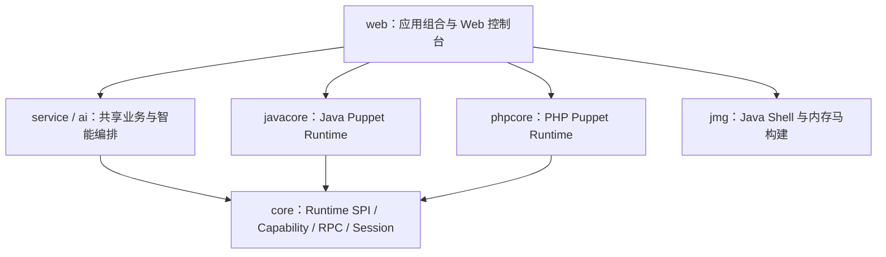
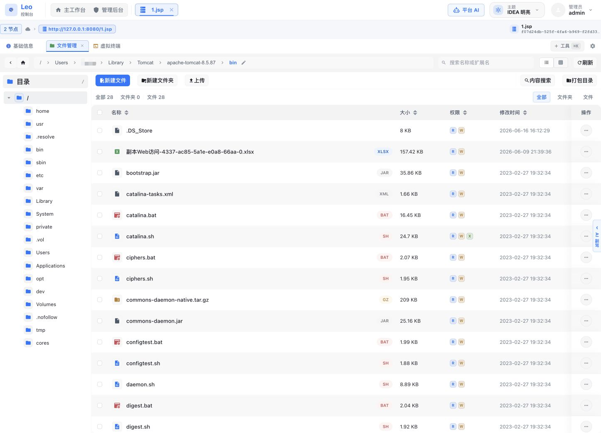
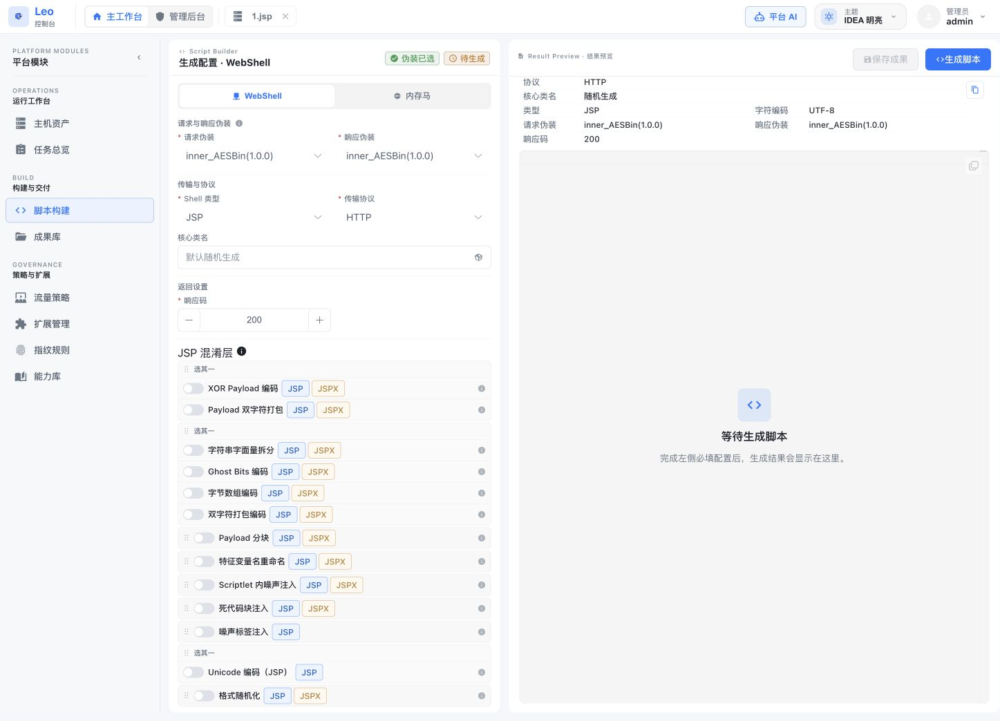
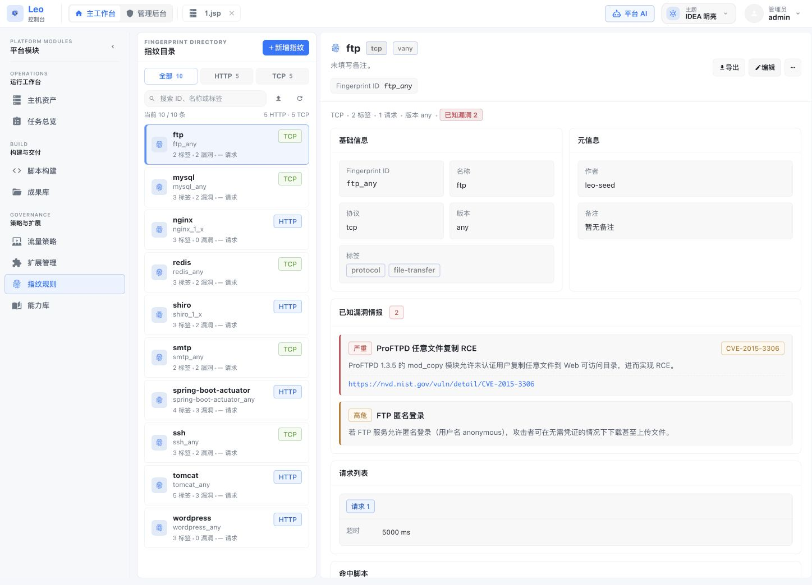
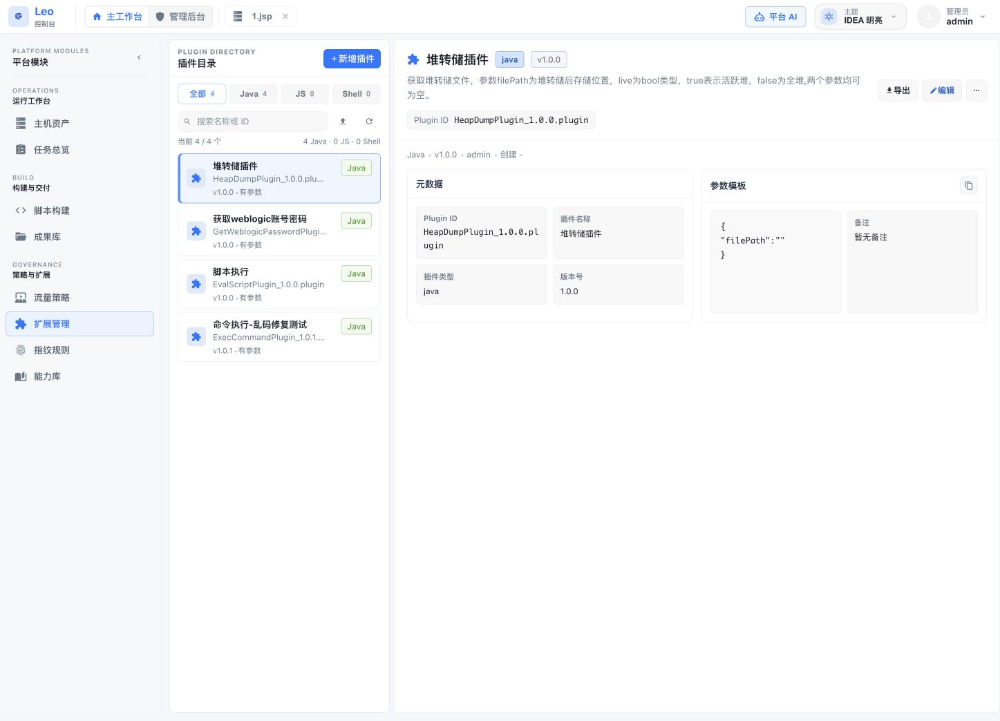
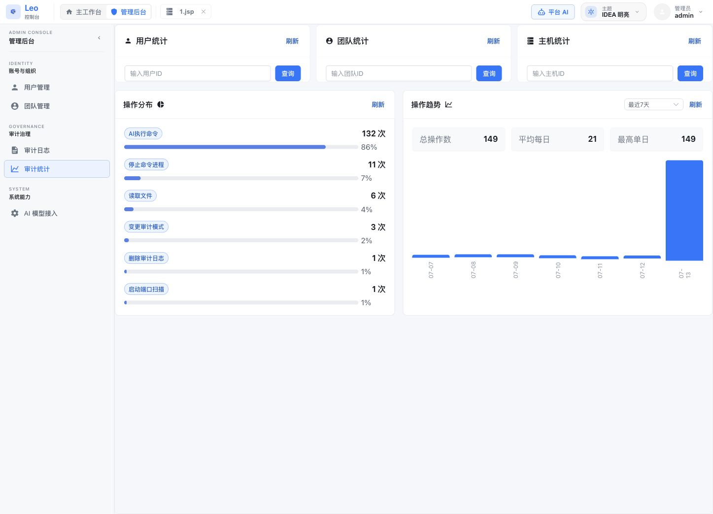
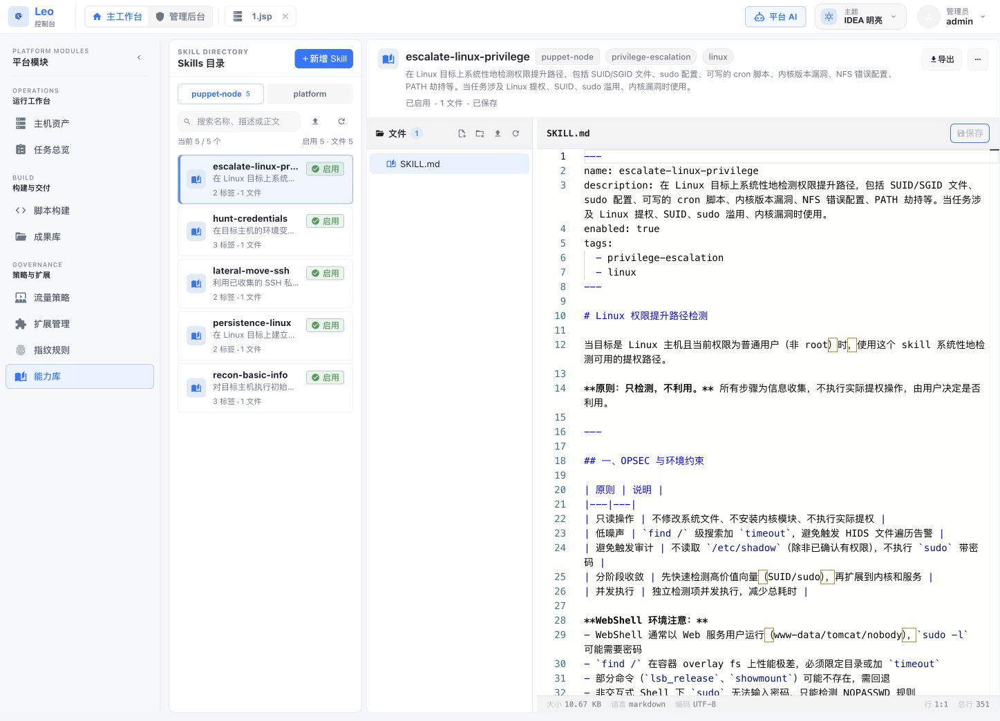
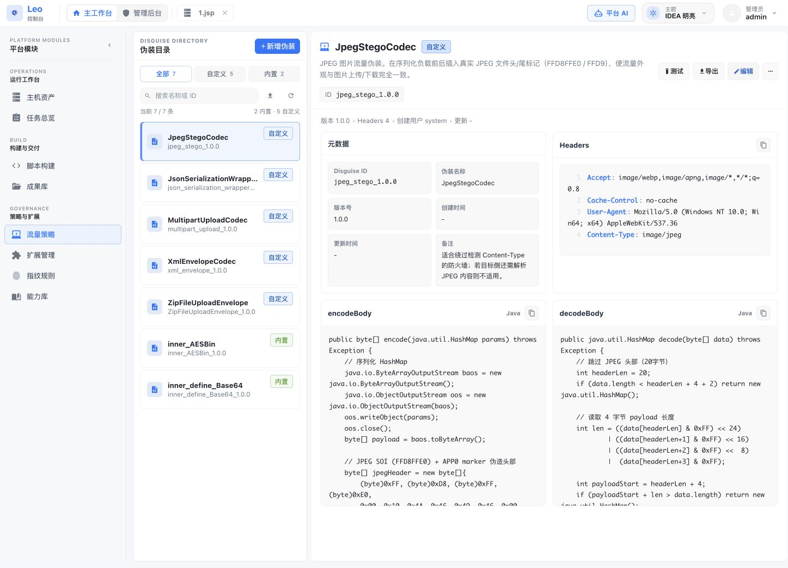

[English](README_EN.md) | **中文**

<div align="center">


# LeoAI

**AI 驱动的后渗透与主机协同管理平台**

[](LICENSE)
[](https://openjdk.org/)
[](https://www.php.net/)
[](https://spring.io/projects/spring-boot)
[](https://github.com/langchain4j/langchain4j)

LeoAI 面向获得合法授权的红队与安全研究场景，将主机资产、Puppet 操作控制台、平台级 AI、节点级 AI 副驾和团队协作整合在同一套 Web 工作台中。v1.0.0 引入平等的 Java/PHP Puppet 双运行时，平台根据节点能力动态装配控制台与 AI 工具；平台 AI 可以将任务委派给指定 Puppet AI，节点 AI 则在当前会话上下文中调用工具、持续回传执行过程并沉淀侦察结果。


*主工作台：主机目录、缓存与在线会话、主机详情和流量策略集中管理*

</div>

---

## 目录

- [v1.0.0 版本亮点](#v100-版本亮点)
- [Java/PHP 双运行时](#javaphp-双运行时)
- [功能特性](#功能特性)
- [工作方式](#工作方式)
- [技术栈](#技术栈)
- [环境要求](#环境要求)
- [快速开始](#快速开始)
- [配置说明](#配置说明)
- [使用指南](#使用指南)
- [常见问题](#常见问题)
- [安全建议](#安全建议)
- [免责声明](#免责声明)
- [License](#license)

---

## v1.0.0 版本亮点

v1.0.0 是 LeoAI 首个正式开源版本，也是一次覆盖运行时、组件、平台服务、Web 控制台和部署方式的大版本升级。

| 方向 | v1.0.0 主要变化 |
|------|----------------|
| **PHP Puppet** | 新增 PHP 5.6+ 单文件入口、HTTP RPC、按需 Component 与运行时能力注册；覆盖命令、文件、终端、数据库、网络、代理隧道和基础系统管理 |
| **双运行时架构** | Java 与 PHP 通过同一 `PuppetRuntimeModule` SPI、Capability 契约和 RPC 响应协议接入，上层服务按能力工作，而非绑定具体运行时 |
| **Component 稳定性** | Java/PHP Component 加入有界任务、TTL、资源注销、缓存上限和生命周期清理；Java 构建产物同步精简调试元数据与冗余常量 |
| **控制台与 AI** | Puppet 路由、插件、文件传输、SQL、代理、后台任务和 AI SSE 统一到共享服务边界；界面按 Runtime Profile 展示可用功能 |
| **全新数据库基线** | `schema.sql` 与 `data.sql` 直接建立 v1.0.0 最终结构，首次启动创建 SQLite、基础配置及管理员账户 |
| **发布与部署** | Maven 模块、前端、Docker 和制品统一使用 `1.0.0`；正式制品为 `LeoAi-1.0.0.jar`，首次登录强制修改初始密码 |

> **安装基线**：v1.0.0 按全新安装发布。部署正式版本时请使用新的数据目录；旧测试版本的数据文件、Component 缓存和生成制品不作为升级输入。

---

## Java/PHP 双运行时

Java 与 PHP 是平等的 Puppet Runtime。共享模块只定义协议、会话和能力契约，具体实现分别位于 `javacore` 与 `phpcore`，`web` 负责最终组装。



| 能力 | Java Puppet | PHP Puppet |
|------|-------------|------------|
| **入口形态** | Java Core 与容器/脚本生成器 | PHP 5.6+ 单文件 HTTP 入口 |
| **组件加载** | 独立 Java Component 字节码按需加载 | 独立 PHP Component 按 digest 懒加载 |
| **命令与终端** | `ProcessBuilder`、PTY/pipe 会话 | `proc_open`、Python PTY/命令后端 |
| **文件能力** | 浏览、编辑、分块传输、压缩与哈希 | 浏览、编辑、分块传输、压缩与哈希 |
| **数据库** | 统一连接描述转换为 JDBC 参数 | 统一连接描述转换为 PDO DSN |
| **网络能力** | HTTP、扫描、SOCKS5/HTTP 代理、正反向隧道 | HTTP、扫描、SOCKS5/HTTP 代理、正反向隧道 |
| **能力发现** | Runtime Profile 动态声明 | Runtime Profile 动态声明 |

PHP 目标的具体能力取决于其扩展与系统函数：数据库需要相应 PDO Driver，压缩需要 `ZipArchive`，持续代理/隧道 Worker 至少需要 `shell_exec`、`exec` 或 `popen` 之一。更完整的模块边界与能力矩阵见 [docs/runtime-modules.md](docs/runtime-modules.md)。

---

## 功能特性

### 核心能力一览

| 能力域 | LeoAI 提供的能力 |
|--------|------------------|
| **AI 协同** | 平台 AI 统一分析与任务分发，Puppet AI 在目标会话内执行；支持实时过程回传、多轮工具调用、计划跟踪和报告归档 |
| **主机与会话** | 主机资产目录、在线会话挂载、离线缓存、节点链路、HostId 与批量管理 |
| **操作控制台** | 文件、终端、数据库、扫描、HTTP 发包、代理隧道、系统管理、容器管理和脚本插件等模块化工具 |
| **构建与扩展** | Shell/内存马构建、流量伪装、指纹规则、插件、Skills 与能力库管理 |
| **团队治理** | 用户与团队边界、主机共享、操作审计、AI 审计和成果归档 |

### AI 与智能化

| 功能 | 描述 |
|------|------|
| **AI Agent 自动化** | 基于 LangChain4j，支持多轮工具调用和并行执行，自动规划和执行后渗透操作 |
| **平台 AI → Puppet AI** | 平台 AI 可选择目标 Puppet 分发任务，在平台会话中查看子任务状态与执行过程，并接收最终交付 |
| **多模型支持** | 兼容 OpenAI、通义千问、DeepSeek、Claude 等，支持运行时热切换 |
| **统一 AI 输入区** | 平台 AI 与 Puppet AI 均支持模型切换、推理强度切换和文本/代码文件输入；切换结果会在会话中明确提示 |
| **大上下文窗口** | 动态适配模型上下文窗口（最高 1M），自动压缩历史消息保留关键信息 |
| **任务计划** | AI 自动规划多步任务、逐步执行并回写结果，前端顶栏实时追踪进度 |
| **100+ 个 AI Tools** | AI Agent 可调用的原子能力，涵盖命令执行、文件、网络、凭据、扫描、HTTP 发包、数据库、脚本、插件等全场景 |
| **多套内置 AI Skills** | 预置 puppet-node / platform 两类场景化任务提示词，一键启动侦察、凭据收集、提权、持久化、横向移动、伪装开发、指纹开发、漏洞建议等流程 |
| **Skill 管理器** | 可视化管理 Skills：查看/编辑内容与描述、标签分类、启用/禁用、全文搜索、导入/导出，修改实时生效无需重启 |
| **上下文积累** | 侦察摘要自动积累与压缩，AI 上下文随操作深入持续增强 |
| **操作报告生成** | AI 自动生成操作总结和风险分析报告 |


*平台 AI：多会话管理、思考过程、执行结果、模型与推理强度切换、文件输入*

### 主机与会话管理

| 功能 | 描述 |
|------|------|
| **多协议通信** | HTTP、HTTP Chunked（大文件传输）、WebSocket（实时交互） |
| **流量隐蔽** | TLS 指纹伪装、Header 噪声注入、URL 随机化、请求/响应自定义编码 |
| **代理转发** | 支持 HTTP 代理、SOCKS5 代理、本地端口转发（ssh -L 风格）、反向隧道（ssh -R 风格） |
| **团队协作** | 节点可在团队成员间共享，权限可控 |
| **主机目录** | 统一管理主机配置、在线会话和离线缓存，并呈现连接与更新时间状态 |
| **批量主机管理** | 支持主机导入、搜索、排序和批量操作 |

### 操作控制台工具集

#### 交互与命令执行
- **虚拟终端**：基于 xterm.js 的多会话交互式 Shell，支持实时流输出、会话搜索、清屏、中断、关闭和后端进程生命周期清理
- **后台任务**：异步执行长时间命令，支持输出轮询和任务取消

#### 文件与存储
- **文件管理器**：树形目录浏览、上传/下载、在线编辑、压缩/解压、预览（文本/图片/PDF）、大文件分片传输
- **用户文件空间**：每个用户独立的本地文件存储区域



*Puppet 文件管理器：目录树、面包屑、类型筛选、权限信息和批量文件操作*

#### 数据库与信息系统
- **数据库控制台**：支持 MySQL、PostgreSQL、Oracle、SQLite、SQL Server，提供 SQL 编辑器和表结构浏览
- **注册表管理**（Windows）：浏览和修改注册表键值
- **事件日志查看**：查询 Windows 系统事件日志
- **防火墙管理**：查看和修改防火墙规则

#### 网络与扫描
- **端口扫描**：TCP 端口扫描、主机存活探测（Ping Sweep）
- **指纹识别**：HTTP/TCP 服务指纹识别，内置规则库，支持自定义规则
- **侦察扫描**：多目标、多规则并发侦察，结果自动汇总至 AI 上下文
- **HTTP 发包器**：Repeater（单次发包）和 Fuzzer（批量模糊测试）
- **代理转发**：在目标节点上开启 HTTP 代理、SOCKS5 代理、本地端口转发（ssh -L）或反向隧道（ssh -R），支持连接数统计与流量监控

#### 系统管理
- **截屏**：实时获取目标桌面截图
- **进程管理**：列出、杀死、创建进程
- **计划任务**：Windows 计划任务管理
- **服务管理**：启动、停止、重启 Windows 服务
- **Docker 管理**：列出、启动、停止、查看容器和镜像
- **应用管理**：Tomcat 6–11、WebLogic 10/12/14、Jetty、Undertow、JBoss/WildFly、WebSphere、Spring MVC 与 Spring WebFlux 运行时画像；支持移除 Filter / Servlet / Valve / Listener / Controller / Interceptor

#### 安全与权限
- **凭据提取**：系统凭据、浏览器数据
- **SUID/Capability 检查**：快速发现 Linux 提权点
- **用户账户管理**：目标主机用户枚举和操作
- **网络连接查看**：查看活跃连接、网络共享、已安装软件

#### 其他工具
- **类字节码查看**：提取并反编译 JVM 中的已加载类
- **类与资源浏览**：按类名或路径读取 puppet 进程的 classpath 资源（jar 内 .class、`application.yml`、`META-INF/MANIFEST.MF` 等），自动识别二进制/文本/.class 类型并反编译为 Java 源码；当 puppet 注入 Tomcat 全局 ClassLoader 时，自动降级遍历所有 WebappClassLoader 兜底
- **HostId 切换**：单节点可管理多个内网主机


*Puppet 控制台：运行态概览、模块标签页与具备当前会话上下文的 AI 副驾*

### Shell 生成器

#### 内存马生成
- 支持类型：Filter、Servlet、Listener、Valve、Interceptor、Controller、WebSocket、HTTP UpgradeProtocol、WebFlux WebFilter/HandlerMethod/HandlerFunction、Netty Handler、Dubbo Service
- 支持中间件：Tomcat、Jetty5、Jetty、JBoss/JBossAS、JBossEAP6、JBossEAP7、Wildfly、Undertow、Resin2、Resin、Glassfish、Payara、WebLogic、WebSphere、SpringWebMVC、Apusic、BES、InforSuite、TongWeb、Struts2、SpringWebFlux、XXL-JOB、Dubbo（共 24 种）
- TongWeb Valve 按主版本适配运行时契约：6 → `com.tongweb.web.thor`、7 → `com.tongweb.catalina`、8 → `com.tongweb.server`；界面与 API 会要求选择 `serverVersion`
- Agent 挂载已覆盖 Tomcat/JBoss/GlassFish/Payara/InforSuite/TongWeb 的 FilterChain 与 ContextValve、Jetty Handler、Undertow ServletHandler、Resin FilterChain、WebLogic ServletContext、WebSphere FilterManager、Spring MVC FrameworkServlet、Apusic 和 BES；Jetty 7–11 另提供普通根 Handler 挂载；Tomcat WebSocket 提供反向代理兼容挂载，并以单类 JDK Proxy Valve 补齐 Upgrade 请求；Tomcat 8.5–11 还提供 Connector 级 `UpgradeInjector`，生成结果会给出 `Connection: Upgrade` 与动态 `Upgrade: <shellClassName>` 激活头；保留 Header 门禁、自定义响应码、HTTP Chunk、Lambda 类名后缀等构建能力
- `AgentJarBase64` 产物含 `premain`/`agentmain` 清单，可用于 `-javaagent` 与 Attach API
- XXL-JOB 2.2–2.5 使用 `XxlJob`/`XxlJobJson` 请求体，2.0–2.1 使用 `XxlJobHessian`；能力目录会按 `serverVersion` 校验 Packer
- Packer：OGNL、SpEL、EL、Groovy、Freemarker、MVEL、BeanShell、Velocity、Thymeleaf、JEXL、Jinjava、JXPath、Rhino、Aviator、ScriptEngine、BCEL、Translet、XmlDecoder、H2、Base64、Hex、JarBase64、AgentJarBase64、XXL-JOB JSON/Hessian 等（共 49 种）
- 构建策略：Lambda 风格类名后缀、Injector 静态初始化、Class 瘦身、JDK 9+ 自动模块兼容；能力元数据会隐藏全局挂载点的 URL 配置，并对 Agent 挂载关闭静态初始化；Packer 可同时取得 Core、Shell、Injector 三阶段类条目

#### WebShell 生成
- 支持格式：JSP、JSPX、Groovy



*脚本构建：通信协议、请求/响应伪装、混淆流水线和结果预览*

每次 Java 构建除最终 Packer 文本外，还会生成可单独下载的 Core、Shell、Injector
Class 产物；界面展示各文件大小，服务端同时返回 SHA-256 摘要用于完整性校验。

### 指纹与识别规则

- **内置规则库**：预置 10 条常见服务的 HTTP/TCP 指纹识别规则（Nginx、Tomcat、Redis、MySQL、Shiro、SSH、FTP、SMTP、Spring Boot Actuator、WordPress 等）
- **自定义规则**：通过「**识别规则**」页面新增、编辑、启用/禁用指纹规则
- **规则标签**：支持协议过滤和标签分组，便于在扫描时按需筛选
- **导入/导出**：支持单条或批量导出为 `.json` / `.zip`，可按冲突策略（跳过/覆盖/重命名）导入，方便团队间共享规则库



*指纹规则：HTTP/TCP 规则目录、标签、请求定义与关联漏洞情报*

### 插件与脚本执行

- **统一执行控制台**：「脚本与插件」模块同时承载脚本编辑与字节码执行
  - **脚本编辑器**：支持 JavaScript / Groovy / Python，临时执行无需保存；可一键「保存为插件」
  - **Java Class 执行**：拖拽 `.class` 文件或直接粘贴 base64 字节码（自动清洗 URL-safe / 空白 / padding，自动校验 `cafebabe` magic），临时执行不持久化；可保存为 Java 插件
- **统一插件库**：Java 字节码与 js/groovy/python 脚本插件并存，按类型徽章区分；脚本插件可一键「载入编辑器」再编辑后执行
- **Java 插件热加载**：动态加载和执行自定义 Java 插件
- **AI Skills 内置插件**：脚本执行、命令执行、WebLogic 密码获取、堆转储分析等开箱即用
- **导入/导出**：单条 `.plugin` 或批量 `.zip`，导入时支持跳过/覆盖冲突策略



*扩展管理：Java 与脚本插件目录、元数据、参数模板和导入导出*

### 管理功能

| 功能 | 描述 |
|------|------|
| **用户管理** | 创建用户、角色分配、权限控制 |
| **团队管理** | 创建团队、成员邀请、节点共享 |
| **AI 配置** | 多 LLM 通道配置、模型切换、API Key 管理 |
| **审计日志** | 操作审计（命令执行、文件操作等）、AI 对话审计 |
| **会话管理** | 会话记录、结果导出、操作报告生成 |



*管理后台：账号与组织、审计治理、AI 模型接入和操作趋势统计*

---

## 工作方式

```text
平台 AI
  ├─ 分析平台侧主机、规则、插件与成果
  └─ 将目标相关任务分发给 Puppet AI
       ├─ 在指定会话上下文中调用工具
       ├─ 实时回传思考、工具、计划和子任务状态
       └─ 将执行结果交付回平台 AI 会话
```

- **平台 AI** 适合跨主机分析、任务编排、规则与插件开发、结果汇总。
- **Puppet AI** 适合针对当前目标执行侦察、文件、命令、数据库、网络和系统操作。
- 两类 AI 使用统一输入体验，每个会话独立维护模型选择、推理强度和上下文。
- 高影响工具仍受权限策略与确认流程约束；平台 AI 的任务委派不会绕过 Puppet 会话边界。

---

## 技术栈

| 层级 | 技术选型 |
|------|--------|
| **Web 框架** | Spring Boot 3.5 |
| **AI 框架** | LangChain4j 1.16 |
| **LLM 支持** | OpenAI、通义千问、DeepSeek 及所有 OpenAI 兼容接口 |
| **数据库** | SQLite（内嵌，无需额外部署）|
| **ORM** | MyBatis 3 |
| **HTTP 客户端** | OkHttp 4 |
| **字节码操作** | Javassist 3.30 |
| **构建工具** | Maven（多模块）|
| **平台运行环境** | Java 17+ |
| **Puppet Runtime** | Java Component、PHP 5.6+ Component |

---

## 环境要求

| 项目 | 要求 |
|------|------|
| **Java 版本** | 17 或更高（JDK/JRE 均可） |
| **操作系统** | Linux、macOS、Windows |
| **内存** | 建议 4 GB 以上 |
| **磁盘** | 至少 500 MB 可用空间 |
| **浏览器** | Chrome、Firefox、Edge 等现代浏览器 |
| **PHP Puppet** | 目标环境 PHP 5.6+；按所用能力安装 PDO/ZipArchive 等扩展 |

> 无需单独安装数据库：内置 SQLite，首次启动自动初始化。  
> 无需额外部署前端：Web 界面已打包至 JAR 文件中。

---

## 快速开始

### 第一步：获取 JAR

> v1.0.0 使用全新数据库基线。首次部署请准备新的运行目录或新的 SQLite 路径。

从 [Releases](https://github.com/cha0upup/LeoAI/releases) 页面下载需要的版本：

```
LeoAi-2.1.0.jar
```

### 第二步：启动

```bash
java --add-opens java.base/java.lang=ALL-UNNAMED -jar LeoAi-2.1.0.jar
```

> `--add-opens java.base/java.lang=ALL-UNNAMED` 参数**不可省略**，用于开放 Java 模块系统内部访问权限。

### 第三步：访问

浏览器打开：

```
http://localhost:8082
```

### 第四步：初始化

首次启动时，系统自动完成以下操作：

1. 初始化 SQLite 数据库（在运行目录下生成 `data.db`）
2. 创建默认管理员账户
3. 初始化基础配置

**初始账号**：`admin`，初始密码：`54ikun`。首次登录后系统将强制修改密码。

---

### Docker 启动

如果你不想折腾 Java 环境，直接用 Docker 一条命令启动即可。镜像构建时会自动从 Release 页面下载 JAR，不需要在本机装 JDK/Maven，也不会编译源码。

#### 第一步：安装 Docker

| 系统 | 操作 |
|------|------|
| **Windows / macOS** | 下载 [Docker Desktop](https://www.docker.com/products/docker-desktop/) 并安装，启动后保持 Docker 桌面在后台运行 |
| **Linux** | 按 [官方文档](https://docs.docker.com/engine/install/) 安装 docker engine 和 docker compose 插件 |

安装完成后打开终端验证（任意目录均可）：

```bash
docker --version
docker compose version
```

只要能看到版本号即可。

> **提示**：以下命令不需要 `sudo` 时尽量不用。Linux 下若提示 `permission denied`，把当前用户加入 `docker` 组（`sudo usermod -aG docker $USER` 后重新登录），或者命令前加 `sudo`。

#### 第二步：获取项目代码

任选一种方式：

```bash
# 方式 A：使用 git（推荐，便于后续更新）
git clone https://github.com/cha0upup/LeoAI.git
cd LeoAI

# 方式 B：直接下载 ZIP
# 打开 https://github.com/cha0upup/LeoAI 点击 Code → Download ZIP
# 解压后在终端 cd 进解压目录
```

#### 第三步：一键启动

在项目根目录（能看到 `Dockerfile` 和 `docker-compose.yml` 的位置）执行：

```bash
docker compose up -d --build
```

参数说明：
- `up`：启动服务
- `-d`：后台运行（detached），关闭终端不会停止容器
- `--build`：首次启动或代码更新时构建镜像；之后日常启动可省略

首次启动需要拉取基础镜像 + 下载 JAR + 安装运行时依赖，**国内网络通常需要 3~10 分钟**。看到类似下面的输出就成功了：

```text
[+] Running 2/2
 ✔ Network leoai_default     Created
 ✔ Container leoai           Started
```

#### 第四步：访问 Web 界面

浏览器打开：

```text
http://localhost:8082
```

**初始账号**：`admin`，初始密码：`54ikun`。首次登录后系统将强制修改密码。

#### 常用命令速查

```bash
# 查看运行状态
docker compose ps

# 查看实时日志（Ctrl+C 退出，容器继续运行）
docker compose logs -f

# 停止服务（保留数据）
docker compose stop

# 重新启动
docker compose start

# 完全停止并删除容器（保留数据 volume）
docker compose down

# 完全清理（含数据，⚠️ 不可恢复）
docker compose down -v

# 升级到最新版本（拉取新代码 + JAR 重新构建）
git pull
docker compose up -d --build
```

#### 数据持久化

SQLite 数据库和 VFS 运行目录都会保存在名为 `leoai-data` 的 Docker volume 里。容器删了重建数据不会丢，除非显式 `docker compose down -v`。

查看 volume 实际位置：

```bash
docker volume inspect leoai_leoai-data
```

#### 自定义配置

最简单的做法是在项目根目录新建 `.env` 文件，docker compose 会自动读取：

```bash
# 修改 Web 端口（避开 8082 被占用的情况）
LEOAI_PORT=9090

# 生产环境建议改成强随机字符串（至少 16 位）
LEO_PLUGIN_ENCRYPT_KEY=please-change-me-to-a-strong-key

# 锁定到特定版本的 JAR；默认值以 docker-compose.yml / Dockerfile 为准
# JAR_URL=https://github.com/cha0upup/LeoAI/releases/download/vX.Y.Z/LeoAi-X.Y.Z.jar
```

修改 `.env` 后用 `docker compose up -d` 让改动生效。**注意**：改 `JAR_URL` 必须加 `--build`，否则不会重新拉取。

也可以通过命令行覆盖端口：

```bash
LEOAI_PORT=9090 docker compose up -d
```

#### 常见问题

**端口冲突 `Bind for 0.0.0.0:8082 failed: port is already allocated`**
- 在 `.env` 里改 `LEOAI_PORT=9090`（或任意空闲端口）后重新 `docker compose up -d`

**镜像构建卡在下载 JAR**
- 多半是 GitHub 网络不通。挂代理后重新 `docker compose build`，或先手动把 JAR 下载到本地，改 Dockerfile 的 `JAR_URL` 指向局域网镜像

**忘记 admin 密码**
- 执行 `docker compose down -v` 清除数据 volume（⚠️ 全部数据丢失），重新 `docker compose up -d --build` 即可用初始密码登录

**查看容器内文件**
- `docker compose exec leoai sh` 进入容器，数据目录在 `/app/data`

---

## 配置说明

### 修改端口

默认端口为 `8082`，通过启动参数修改：

```bash
java --add-opens java.base/java.lang=ALL-UNNAMED -jar \
  LeoAi-2.1.0.jar --server.port=9090
```

### 修改数据库位置

默认数据库文件为运行目录下的 `data.db`：

```bash
java --add-opens java.base/java.lang=ALL-UNNAMED -jar \
  LeoAi-2.1.0.jar \
  --spring.datasource.url=jdbc:sqlite:/path/to/data.db
```

### 配置 AI 模型

LeoAI 的 AI 功能从管理后台读取 Provider 与模型配置：

1. 登录后进入「**管理后台 → AI 配置**」
2. 点击「**添加通道**」
3. 填写通道名称、API Key、Base URL、模型名称
4. 点击「**测试连接**」验证后保存

### 支持的 AI 模型

兼容任何遵循 OpenAI API 格式的服务：

| 提供商 | Base URL 示例 |
|--------|-----------|
| OpenAI | `https://api.openai.com/v1` |
| 通义千问（阿里） | `https://dashscope.aliyuncs.com/compatible-mode/v1` |
| DeepSeek | `https://api.deepseek.com` |
| Ollama（本地） | `http://localhost:11434/v1` |
| 其他兼容接口 | 根据文档填写对应地址 |

### 主要配置项参考

`web/src/main/resources/application.properties`：

```properties
# 服务器端口
server.port=8082

# 数据库（SQLite，路径相对于运行目录）
spring.datasource.url=jdbc:sqlite:data.db

```

---

## 使用指南

### 添加主机

1. 登录后进入「**主工作台 → 主机资产**」
2. 点击「**新增主机**」，填写：
   - **主机名称**：自定义标识
   - **运行时类型**：根据入口选择 Java 或 PHP
   - **目标 URL**：目标 Puppet 地址（如 `http://target.com/shell`）
   - **通信协议**：HTTP / HTTP Chunked / WebSocket
   - **访问密钥**：与 Shell 端保持一致
3. 按需配置流量伪装模板，保存

#### 协议选择参考

| 协议 | 适用场景 |
|------|---------|
| **HTTP** | 通用场景，防火墙穿透性最好 |
| **HTTP Chunked** | 大文件传输、长日志查询 |
| **WebSocket** | 终端交互等低延迟需求 |

### 操作控制台

进入节点后可使用各工具模块：

- **虚拟终端**：多会话执行 Shell 命令，实时流式输出；支持检索输出、清屏、中断、关闭会话，并在关闭/重置时回收后端进程
- **文件管理**：树形浏览、上传下载、在线编辑、压缩解压、文件预览
- **数据库**：在数据库工作台添加统一连接配置，Java/PHP Puppet 会分别转换为 JDBC/PDO 运行参数
- **端口扫描**：快速扫描 / 自定义端口范围 / 结果导出
- **HTTP 发包器**：Repeater 单次发包，Fuzzer 批量模糊测试

### 代理与隧道

在节点控制台的「**代理**」面板下可管理四种流量转发模式：

| 模式 | 说明 | 典型场景 |
|------|------|---------|
| **SOCKS5 代理** | 在节点上开 SOCKS5 监听，C2 通过它访问内网 | Proxychains / Burp 上游代理 |
| **HTTP 代理** | 同上，HTTP CONNECT 隧道，兼容性更好 | 浏览器手动代理 |
| **本地端口转发**（ssh -L） | C2 本地端口 → 节点 → 内网 host:port | 直连内网单服务（RDP、DB 等） |
| **反向隧道**（ssh -R） | 节点开监听 → 内网客户端主动连 → C2 拨号转发 | 让内网机器主动回连 payload 服务器 |

各模式均提供连接数、上传/下载流量统计面板，支持一键停止。

### Skill 管理器

进入主工作台侧边栏「**能力库**」，可对两个 scope（puppet-node / platform）下的所有 Skills 进行可视化管理：

- **查看与编辑**：点击列表中的 Skill 可在右侧预览内容；切换到编辑模式后可修改正文和描述，保存后实时生效，无需重启
- **标签（Tags）**：每个 Skill 可附加多个标签（如 `recon`、`exploit`、`linux`），在列表和编辑模式中均可查看和修改；左侧提供标签筛选面板，可多选组合过滤
- **启用 / 禁用**：禁用的 Skill 不会出现在 AI 的 system prompt 中，AI 对其存在完全无感知；可按需关闭暂不使用的 Skill 以节省 token
- **全文搜索**：支持按 name、description 或正文内容模糊搜索
- **新建 / 删除**：可创建自定义 Skill，填写名称、描述后在编辑器中编写 Skill 提示词
- **导入/导出**：可将单条 Skill 导出为 `.skill` 文件，或勾选多条批量导出为 `.zip`；导入包必须同时包含 `SKILL.md` 与 `manifest.yaml`，并统一以 `draft + disabled` 状态进入能力库，审核后才能发布启用
- **分类治理**：Skill 通过 `manifest.yaml` 声明稳定 ID、版本、scope、能力域、主分类、运行模式、ATT&CK 映射、平台、目标、能力包、风险、访问模式、状态、来源和依赖；管理页支持筛选与 Catalog 健康检查



*能力库：按作用域管理 Skills，并在文件树与编辑器中维护完整 Skill 内容*

Skill 文件存储在 VFS 目录下，格式为标准 Markdown + YAML frontmatter：

```markdown
---
name: recon-basic-info
description: 对目标主机执行初始基础信息侦察...
enabled: true
tags:
  - recon
  - linux
---

# Skill 正文内容
...
```

### AI 助手

**Puppet AI / AI 副驾**：进入主机控制台后，在右侧 AI 面板输入指令（如“扫描 C 类网段的 80 端口”）。AI 会基于当前 Puppet 会话调用工具、展示执行过程，并持续积累侦察上下文。

AI 副驾提供侦察、凭据、提权、横向移动和 Web 容器检查等快捷入口；也可以通过 `/` 调出常用指令。内置 puppet-node Skills 可启动完整场景任务：

| 类别 | Skills |
|------|--------|
| **侦察** | `recon-basic-info` |
| **凭据收集** | `hunt-credentials` |
| **权限提升** | `escalate-linux-privilege` |
| **持久化** | `persistence-linux` |
| **横向移动** | `lateral-move-ssh` |

**平台 AI**：从页面右上角随时打开。它可以分析平台资源、编写流量伪装与指纹规则、给出漏洞建议，也可以选定目标 Puppet，将任务分发给 Puppet AI 执行并在当前会话中跟踪过程。

两类 AI 的输入区均支持：

- 在可用通道之间热切换模型，成功后在会话中显示当前模型；
- 按模型能力选择低 / 中 / 高 / 极高推理强度；
- 添加文本、代码、日志和配置文件作为本轮上下文；
- `Enter` 发送、`Shift + Enter` 换行，执行期间可停止当前任务。

### Shell 生成

1. 进入「**主工作台 → 脚本构建**」
2. 选择「**内存马**」或「**WebShell**」
3. 选择通信协议：JSP/JSPX WebShell 支持 HTTP、HTTP Chunked；内存构建支持 HTTP、HTTP Chunked、WebSocket
4. 内存构建按后端能力矩阵选择目标中间件和注入器；HTTP Chunk 使用普通注入器形态名，WebSocket 使用端点路径
5. 配置连接密钥，点击「**生成**」
6. 生成完成后可从「**Class 产物**」菜单分别下载 Core、Shell 与 Injector；WebShell 构建提供 Core Class

### 流量伪装

> 流量伪装只负责包装不透明字节。PayloadCodec 固定完成序列化、GZIP 压缩和 AES 加密，AES 密钥由用户在生成与连接时输入；伪装不匹配则请求无法解析。

1. 进入「**工具 → 流量伪装**」，系统内置 JSON API 和表单两套流量包装模板，可作为参考或起点
2. 点击「**新增**」，编写 `trafficEncodeBody` / `trafficDecodeBody` 流量包装逻辑，通过「**测试**」验证任意字节互逆后保存
3. 在 Shell 生成时选择同一个伪装，确保管理端和 Shell 端使用完全一致的编解码实现
4. 在节点配置中将「请求伪装」和「响应伪装」指向对应模板即可生效



*流量策略：伪装目录、Headers、编码与解码逻辑、测试和导入导出*

**导入/导出**：可将单条伪装导出为加密的 `.disguise` 文件，或批量导出为 `.zip`；导入时支持三种冲突策略（跳过/覆盖/重命名），方便在多套环境或团队间迁移伪装配置。

### 团队协作

- 在「**管理后台 → 团队管理**」创建团队并邀请成员
- 在节点详情中点击「**分享**」，指定团队或成员及读写权限
- 所有操作记录在「**管理后台 → 审计日志**」，支持按用户/时间/类型筛选

---

## 常见问题

**Q：启动时报 `InaccessibleObjectException`**

必须添加 `--add-opens` 参数，不可省略：

```bash
java --add-opens java.base/java.lang=ALL-UNNAMED -jar LeoAi-2.1.0.jar
```

---

**Q：AI 功能无响应或报错**

1. 进入「管理后台 → AI 配置」检查通道配置
2. 点击「测试连接」验证 API Key 和 Base URL
3. 确认 API 配额和请求限制
4. 查看服务端日志获取详细错误信息

---

**Q：节点连接失败**

按以下顺序排查：

1. 确认目标 URL 可访问（curl 测试）
2. 确认通信协议与 Shell 实现一致
3. 确认节点密钥与 Shell 端配置一致
4. 若使用流量伪装，确认模板两端编解码逻辑匹配
5. 查看浏览器 Network 面板和服务端日志

---

**Q：如何重置管理员密码**

停止应用 → 删除（或备份）`data.db` → 重新启动 → 使用账号 `admin` 和初始密码 `54ikun` 登录。

---

**Q：支持 HTTPS 吗**

建议通过前置 Nginx / Apache 反向代理层配置 SSL，将 HTTPS 请求转发至 LeoAI。

---

**Q：data.db 文件在哪里**

默认在 JAR 的运行目录下，可通过启动参数指定自定义路径：

```bash
--spring.datasource.url=jdbc:sqlite:/custom/path/data.db
```

---

## 安全建议

**部署安全**

- 在受信任的内网或 VPN 环境中部署，不要将管理端口暴露至公网
- 首次登录后按页面提示完成管理员密码修改
- 定期备份 `data.db` 文件
- 使用防火墙或 IP 白名单限制访问来源

**操作安全**

- 遵循最小权限原则，为不同成员分配必要的最小权限
- 不同项目使用不同团队账户进行隔离
- 妥善保管 LLM API Key，避免在日志或截图中泄露
- 在存在流量检测风险的环境中启用流量伪装功能
- **每位用户创建专属伪装**，不同项目使用不同伪装，避免共享内置模板——伪装即通信密钥，泄露即意味着通信可被模拟或解密

---

## 免责声明

**本工具仅供已获得明确书面授权的安全测试、红队攻防演练和安全研究使用。** 使用者须确保已取得目标系统所有者的合法授权。任何未经授权的访问、修改或破坏行为均属违法，开发者不对任何滥用或违法使用行为承担责任。使用本工具即表示你同意承担全部相关法律责任。

---

## License

本项目采用 [GNU General Public License v3.0](LICENSE) 许可证。

---

## 联系与反馈

- Issue：[GitHub Issues](https://github.com/cha0upup/LeoAI/issues)
- 邮件：chaodovvn@gmail.com
- 项目主页：[https://github.com/cha0upup/LeoAI](https://github.com/cha0upup/LeoAI)
