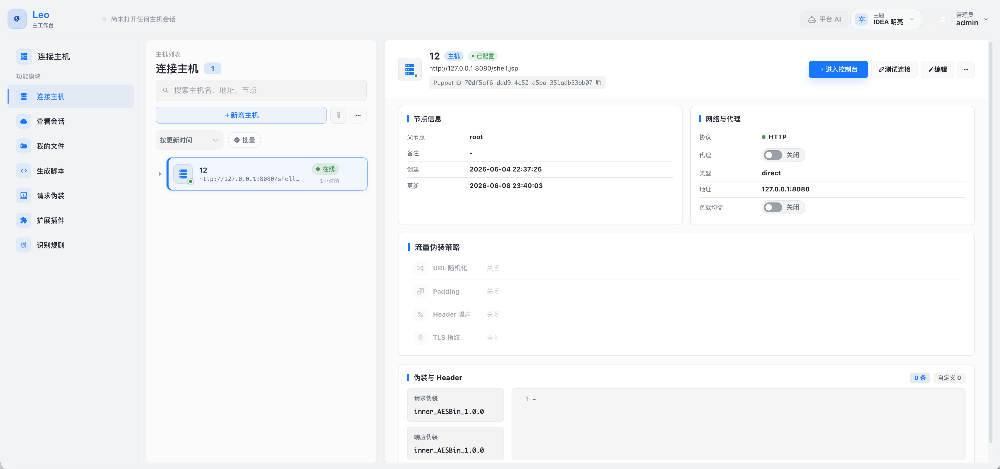
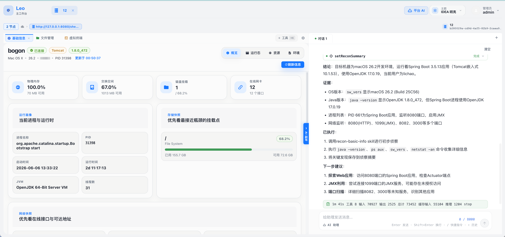
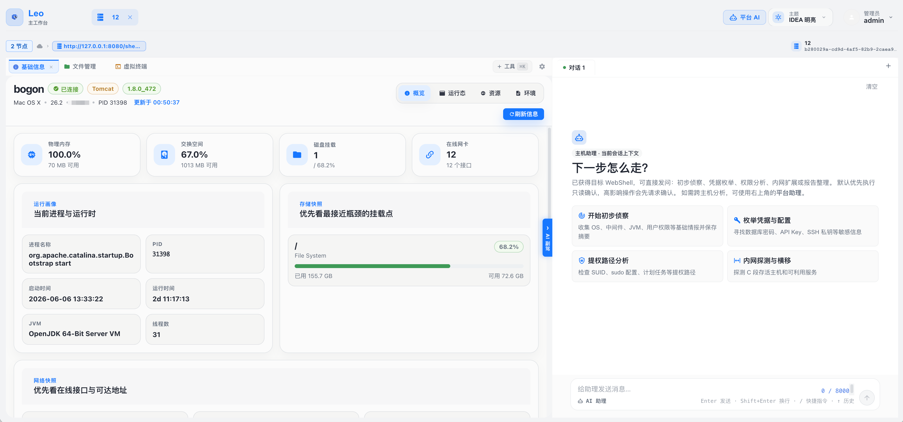

**English** | [中文](README.md)

<div align="center">


# LeoAI

**AI-Powered Post-Exploitation Management Platform**

[](LICENSE)
[](https://openjdk.org/)
[](https://spring.io/projects/spring-boot)
[](https://github.com/langchain4j/langchain4j)

LeoAI is a post-exploitation management tool designed for red team operators. It deeply integrates Large Language Model (LLM) Agent capabilities to enable intelligent, automated post-exploitation workflows. Compared to traditional WebShell management tools, LeoAI provides enterprise-grade capabilities including AI-assisted decision making, multi-protocol communication, traffic obfuscation, and team collaboration — with a built-in web management interface that works out of the box.



*Main interface: node list, detail panel, and traffic disguise strategy configuration*

</div>

---

## Table of Contents

- [Features](#features)
- [Tech Stack](#tech-stack)
- [Requirements](#requirements)
- [Quick Start](#quick-start)
- [Configuration](#configuration)
- [Usage Guide](#usage-guide)
- [FAQ](#faq)
- [Security Recommendations](#security-recommendations)
- [Disclaimer](#disclaimer)
- [License](#license)

---

## Features

### AI & Intelligence

| Feature | Description |
|---------|-------------|
| **AI Agent Automation** | Built on LangChain4j, supports multi-turn tool calls to automatically plan and execute post-exploitation operations |
| **Multi-Model Support** | Compatible with OpenAI, Anthropic, Qwen, DeepSeek, and any OpenAI-compatible API |
| **175 AI Tools** | Atomic capabilities callable by the AI Agent — covering files, processes, networking, credentials, scanning, HTTP requests, and more |
| **24 Built-in AI Skills** | Pre-configured scenario-based task prompts for launching complete attack chains with one click (see Skills list below) |
| **Skill Manager** | Visually manage Skills: view/edit content and descriptions, tag categorization, enable/disable, full-text search, import/export — changes take effect immediately without restarting |
| **Context Accumulation** | Reconnaissance summaries accumulate automatically; AI context grows richer as operations deepen |
| **Operation Report Generation** | AI automatically generates operation summaries and risk analysis reports |



*AI assistant automatically invoking recon tools, analyzing results, and generating a reconnaissance summary*

### Node Management

| Feature | Description |
|---------|-------------|
| **Multi-Protocol Communication** | HTTP, HTTP Chunked (large file transfer), WebSocket (real-time interaction) |
| **Traffic Concealment** | TLS fingerprint spoofing, header noise injection, URL randomization, custom request/response encoding |
| **Proxy & Tunneling** | HTTP proxy, SOCKS5 proxy, local port forwarding (ssh -L style), reverse tunneling (ssh -R style) |
| **Team Collaboration** | Nodes can be shared among team members with controllable permissions |
| **Batch Node Management** | Node grouping, tag management, bulk operations |

### Operations Console Toolset

#### Interactive & Command Execution
- **Web Terminal**: Interactive shell with command completion, history, and real-time streaming output
- **Background Tasks**: Asynchronous execution of long-running commands, with output polling and task cancellation

#### Files & Storage
- **File Manager**: Tree-style directory browsing, upload/download, online editing, compress/decompress, preview (text/image/PDF), chunked transfer for large files
- **User File Space**: Independent local file storage area for each user

#### Database & Information Systems
- **Database Console**: Supports MySQL, PostgreSQL, Oracle, SQLite, SQL Server — with SQL editor and table structure browser
- **Registry Manager** (Windows): Browse and modify registry keys and values
- **Event Log Viewer**: Query Windows system event logs
- **Firewall Manager**: View and modify firewall rules

#### Network & Scanning
- **Port Scanner**: TCP port scanning, host discovery (Ping Sweep)
- **Fingerprint Identification**: HTTP/TCP service fingerprinting with a built-in rule library and support for custom rules
- **Reconnaissance Scanning**: Concurrent multi-target, multi-rule recon with results automatically aggregated into AI context
- **HTTP Requester**: Repeater (single request) and Fuzzer (bulk fuzzing)
- **Proxy & Tunneling**: Open HTTP proxy, SOCKS5 proxy, local port forwarding (ssh -L), or reverse tunnel (ssh -R) on target nodes — with connection count and traffic monitoring

#### System Management
- **Screenshot**: Real-time capture of target desktop
- **Process Manager**: List, kill, and create processes
- **Scheduled Tasks**: Windows scheduled task management
- **Service Manager**: Start, stop, restart Windows services
- **Docker Manager**: List, start, stop, and inspect containers and images
- **Application Manager**: Catalina applications (Tomcat 6/7/8/9/10/11, WebLogic) and Spring Framework runtime management; tolerant to idle deployments and puppets injected into the global ClassLoader (thread-scan + JMX MBean dual fallback); supports immediate unloading of Filter / Servlet / Valve / Listener / Controller / Interceptor

#### Security & Permissions
- **Credential Harvesting**: System credentials, browser data, WiFi configurations
- **SUID/Capability Check**: Quickly identify Linux privilege escalation vectors
- **User Account Management**: Enumerate and manage users on target hosts
- **Network Connection Viewer**: View active connections, network shares, and installed software

#### Other Tools
- **Class Bytecode Viewer**: Extract and decompile classes loaded in the JVM
- **Class & Resource Browser**: Read any classpath resource the puppet process can see (`.class` files inside jars, `application.yml`, `META-INF/MANIFEST.MF`, etc.) by class name or path. Auto-detects binary/text/`.class` and decompiles to Java source. When the puppet is injected into Tomcat's global ClassLoader, falls back to scanning every WebappClassLoader so webapp-private classes remain reachable.
- **Clipboard Reader**: Retrieve clipboard contents from the target system
- **Disk Mount Manager**: View and manage disk mount points
- **HostId Switching**: Manage multiple intranet hosts under a single node



*Operations console: basic info overview, AI skill quick-launch panel, and chat area*

### Shell Generator

#### Memory Shell Generation
- Supported types: Filter, Servlet, Listener, Valve, Interceptor, WebSocket
- Supported middleware: Tomcat, Jetty, JBoss, JBossAS, JBossEAP6, JBossEAP7, Wildfly, Undertow, Resin, Glassfish, Payara, WebLogic, WebSphere, SpringWebMVC, Apusic, BES, InforSuite, TongWeb, Struct2 (19 total)
- Expression injection packers: OGNL, SpEL, EL, Groovy, Freemarker, MVEL, BeanShell, Velocity, Thymeleaf, JEXL, Jinjava, JXPath, Rhino, Aviator, ScriptEngine, BCEL, Translet, XmlDecoder, H2, Base64, Hex, and more (23 total)

#### WebShell Generation
- Supported formats: JSP, JSPX

### Fingerprint & Identification Rules

- **Built-in Rule Library**: 38 pre-configured HTTP/TCP fingerprint rules for common services (Nginx, Tomcat, Jenkins, Nacos, Redis, MySQL, Elasticsearch, GitLab, etc.)
- **Custom Rules**: Add, edit, enable/disable fingerprint rules via the "Identification Rules" page
- **Rule Tags**: Supports protocol filtering and tag grouping for selective use during scanning
- **Import/Export**: Export individual rules or batch-export as `.json` / `.zip`; import with conflict policies (skip/overwrite/rename) to easily share rule libraries across teams

### Plugins & Script Execution

- **Unified execution console**: the "Scripts & Plugins" module hosts both script editing and bytecode execution
  - **Script editor**: JavaScript / Groovy / Python; run ad-hoc without saving, or save as a script plugin in one click
  - **Java class execution**: drag-and-drop a `.class` file or paste base64 bytecode (URL-safe / whitespace / padding cleanup, `cafebabe` magic check); run ad-hoc or save as a Java plugin
- **Unified plugin library**: Java bytecode and js/groovy/python script plugins coexist with type badges; script plugins can be reloaded into the editor with one click
- **Hot-loading Java plugins**: dynamically load and execute custom Java plugins
- **AI-ready built-in skills**: script execution, command execution, WebLogic password retrieval, heap-dump analysis, and more out of the box
- **Import/Export**: single-file `.plugin` or batch `.zip`; conflict policies (skip / overwrite) on import

### Management Features

| Feature | Description |
|---------|-------------|
| **User Management** | Create users, role assignment, permission control |
| **Team Management** | Create teams, invite members, share nodes |
| **AI Configuration** | Multi-LLM channel configuration, model switching, API key management |
| **Audit Logs** | Operation auditing (command execution, file operations, etc.), AI conversation auditing |
| **Session Management** | Session records, result export, operation report generation |

---

## Tech Stack

| Layer | Technology |
|-------|-----------|
| **Web Framework** | Spring Boot 3.5 |
| **AI Framework** | LangChain4j 1.16 |
| **LLM Support** | OpenAI, Anthropic, Qwen, DeepSeek, and all OpenAI-compatible interfaces |
| **Database** | SQLite (embedded, no separate deployment needed) |
| **ORM** | MyBatis 3 |
| **HTTP Client** | OkHttp 4 |
| **Bytecode Manipulation** | Javassist 3.30 |
| **Build Tool** | Maven (multi-module) |
| **Runtime** | Java 17+ |

---

## Requirements

| Item | Requirement |
|------|-------------|
| **Java Version** | 17 or higher (JDK or JRE) |
| **Operating System** | Linux, macOS, Windows |
| **Memory** | 4 GB or more recommended |
| **Disk Space** | At least 500 MB available |
| **Browser** | Modern browsers: Chrome, Firefox, Edge, etc. |

> No separate database installation needed: SQLite is embedded and auto-initialized on first launch.  
> No separate frontend deployment needed: the web interface is bundled inside the JAR.

---

## Quick Start

### Step 1: Get the JAR

Download the latest release from the [Releases](https://github.com/cha0upup/LeoAI/releases) page:

```
LeoAi-0.0.6-SNAPSHOT.jar
```

### Step 2: Launch

```bash
java -jar --add-opens java.base/java.lang=ALL-UNNAMED LeoAi-0.0.6-SNAPSHOT.jar
```

> The `--add-opens java.base/java.lang=ALL-UNNAMED` flag is **required** — it grants the necessary internal Java module access.

### Step 3: Access

Open your browser and navigate to:

```
http://localhost:8082
```

### Step 4: Initialize

On first launch, the system automatically:

1. Initializes the SQLite database (creates `data.db` in the working directory)
2. Creates the default administrator account
3. Initializes base configuration

**Default credentials**: `admin` / `54ikun` — change the password immediately after first login.

---

### Docker Startup

If you'd rather skip the Java environment setup, Docker gets you running with a single command. The image pulls the JAR from the Releases page at build time — no local JDK or Maven required, and no source compilation.

#### Step 1: Install Docker

| OS | Action |
|----|--------|
| **Windows / macOS** | Download [Docker Desktop](https://www.docker.com/products/docker-desktop/) and install it; keep Docker Desktop running in the background |
| **Linux** | Follow the [official docs](https://docs.docker.com/engine/install/) to install the Docker engine and the Compose plugin |

After installation, open a terminal and verify (from any directory):

```bash
docker --version
docker compose version
```

As long as version numbers appear, you're good.

> **Tip**: Avoid `sudo` when possible. On Linux, if you see `permission denied`, add your user to the `docker` group (`sudo usermod -aG docker $USER`, then re-login), or prefix commands with `sudo`.

#### Step 2: Get the Project

Choose either:

```bash
# Option A: git (recommended — easy to update later)
git clone https://github.com/cha0upup/LeoAI.git
cd LeoAI

# Option B: Download ZIP
# Go to https://github.com/cha0upup/LeoAI, click Code → Download ZIP
# Extract and cd into the extracted directory
```

#### Step 3: One-Command Start

From the project root (where `Dockerfile` and `docker-compose.yml` live):

```bash
docker compose up -d --build
```

Flags explained:
- `up`: start services
- `-d`: detached mode (background) — closing the terminal won't stop the container
- `--build`: builds the image on first launch or after updates; can be omitted for routine starts

The first launch pulls the base image, downloads the JAR, and installs runtime dependencies — **expect 3–10 minutes on typical networks**. Success looks like:

```text
[+] Running 2/2
 ✔ Network leoai_default     Created
 ✔ Container leoai           Started
```

#### Step 4: Access the Web Interface

```text
http://localhost:8082
```

**Default credentials**: `admin` / `54ikun` — change the password immediately after first login.

#### Common Commands

```bash
# Check running status
docker compose ps

# Follow live logs (Ctrl+C to exit; container keeps running)
docker compose logs -f

# Stop services (data preserved)
docker compose stop

# Restart services
docker compose start

# Stop and remove containers (data volume preserved)
docker compose down

# Full cleanup including data (⚠️ irreversible)
docker compose down -v

# Upgrade to the latest version (pull new code + rebuild JAR)
git pull
docker compose up -d --build
```

#### Data Persistence

The SQLite database and VFS working directory are stored in a Docker volume named `leoai-data`. Deleting and recreating the container does not lose data — unless you explicitly run `docker compose down -v`.

To find the volume's physical location:

```bash
docker volume inspect leoai_leoai-data
```

#### Custom Configuration

The simplest approach is to create a `.env` file in the project root — Docker Compose picks it up automatically:

```bash
# Change the web port (if 8082 is already in use)
LEOAI_PORT=9090

# Configure OpenAI or a compatible API
OPENAI_API_KEY=sk-xxxxx
OPENAI_BASE_URL=https://api.openai.com/v1
# Alternative providers:
# OPENAI_BASE_URL=https://api.deepseek.com
# OPENAI_BASE_URL=https://dashscope.aliyuncs.com/compatible-mode/v1

# For production, change this to a strong random string (16+ characters)
LEO_PLUGIN_ENCRYPT_KEY=please-change-me-to-a-strong-key

# Pin to a specific JAR version (defaults to v0.0.6)
# JAR_URL=https://github.com/cha0upup/LeoAI/releases/download/v0.0.6/LeoAi-0.0.6-SNAPSHOT.jar
```

After editing `.env`, run `docker compose up -d` to apply changes. **Note**: changing `JAR_URL` requires `--build` to re-fetch the JAR.

You can also pass overrides inline for a one-time run (non-persistent):

```bash
LEOAI_PORT=9090 OPENAI_API_KEY=sk-xxxxx docker compose up -d
```

#### Troubleshooting

**Port conflict: `Bind for 0.0.0.0:8082 failed: port is already allocated`**
- Set `LEOAI_PORT=9090` (or any free port) in `.env`, then re-run `docker compose up -d`

**Image build hangs while downloading the JAR**
- Usually a GitHub connectivity issue. Use a proxy and retry `docker compose build`, or download the JAR manually and update the `JAR_URL` in the Dockerfile to point to a local mirror

**Forgot the admin password**
- Run `docker compose down -v` to clear the data volume (⚠️ all data will be lost), then `docker compose up -d --build` to start fresh with the default credentials

**Inspect files inside the container**
- Run `docker compose exec leoai sh` to enter the container; data is in `/app/data`

---

## Configuration

### Changing the Port

The default port is `8082`. Override it via a startup argument:

```bash
java -jar --add-opens java.base/java.lang=ALL-UNNAMED \
  LeoAi-0.0.6-SNAPSHOT.jar --server.port=9090
```

### Changing the Database Location

The default database file is `data.db` in the working directory:

```bash
java -jar --add-opens java.base/java.lang=ALL-UNNAMED \
  LeoAi-0.0.6-SNAPSHOT.jar \
  --spring.datasource.url=jdbc:sqlite:/path/to/data.db
```

### Configuring AI Models

LeoAI's AI features require an LLM endpoint. Two configuration methods are available:

#### Method 1: Web Interface (Recommended)

1. Log in and go to **Admin → AI Configuration**
2. Click **Add Channel**
3. Fill in the channel name, API key, base URL, and model name
4. Click **Test Connection** to verify, then save

#### Method 2: Environment Variables

```bash
export OPENAI_API_KEY=your-api-key
export OPENAI_BASE_URL=https://api.openai.com/v1

java -jar --add-opens java.base/java.lang=ALL-UNNAMED LeoAi-0.0.6-SNAPSHOT.jar
```

### Supported AI Models

Compatible with any service that follows the OpenAI API format:

| Provider | Base URL Example |
|----------|-----------------|
| OpenAI | `https://api.openai.com/v1` |
| Anthropic | Via an OpenAI-compatible proxy (e.g., LiteLLM, One-API) |
| Qwen (Alibaba) | `https://dashscope.aliyuncs.com/compatible-mode/v1` |
| DeepSeek | `https://api.deepseek.com` |
| Ollama (local) | `http://localhost:11434/v1` |
| Other compatible APIs | Use the corresponding URL from their documentation |

### Key Configuration Reference

`web/src/main/resources/application.properties`:

```properties
# Server port
server.port=8082

# Database (SQLite, path relative to working directory)
spring.datasource.url=jdbc:sqlite:data.db

# AI configuration (can also be managed via web interface)
leo.ai.openai.api-key=${OPENAI_API_KEY:}
leo.ai.openai.base-url=${OPENAI_BASE_URL:https://api.openai.com/v1}
leo.ai.openai.model=gpt-4o
leo.ai.openai.thinking-enabled=false
```

---

## Usage Guide

### Adding a Node

1. Log in and go to **Node Management**
2. Click **Add Node** and fill in:
   - **Node Name**: a custom identifier
   - **Target URL**: the target node address (e.g., `http://target.com/shell`)
   - **Protocol**: HTTP / HTTP Chunked / WebSocket
   - **Access Key**: must match the shell-side configuration
3. Configure a traffic disguise template as needed, then save

#### Protocol Selection Reference

| Protocol | Best For |
|----------|---------|
| **HTTP** | General use; best firewall traversal |
| **HTTP Chunked** | Large file transfers, long log queries |
| **WebSocket** | Low-latency needs like terminal interaction |

### Operations Console

After entering a node, use the available tool modules:

- **Terminal**: Execute shell commands with real-time streaming output
- **File Manager**: Tree browsing, upload/download, online editing, compress/decompress, file preview
- **Database**: First add a JDBC connection under "System Config → Database Config", then select it in the console
- **Port Scanner**: Quick scan / custom port range / export results
- **HTTP Requester**: Repeater for single requests, Fuzzer for bulk fuzzing

### Proxy & Tunneling

In the **Proxy** panel of the node console, four traffic forwarding modes are available:

| Mode | Description | Typical Use Case |
|------|-------------|-----------------|
| **SOCKS5 Proxy** | Opens a SOCKS5 listener on the node; C2 uses it to reach the intranet | Proxychains / Burp upstream proxy |
| **HTTP Proxy** | Same as above but via HTTP CONNECT tunnel — better compatibility | Browser manual proxy |
| **Local Port Forwarding** (ssh -L) | C2 local port → node → intranet host:port | Direct access to a single intranet service (RDP, DB, etc.) |
| **Reverse Tunnel** (ssh -R) | Node opens a listener → intranet client connects back → C2 dials in | Have an intranet machine call back to your payload server |

All modes provide connection count, upload/download traffic statistics, and a one-click stop button.

### Skill Manager

Navigate to **Skills** in the main sidebar to visually manage all Skills under both scopes (puppet-node / platform):

- **View & Edit**: Click a Skill in the list to preview its content on the right; switch to edit mode to modify the body and description — changes take effect immediately without restarting
- **Tags**: Each Skill can have multiple tags (e.g., `recon`, `exploit`, `linux`), viewable and editable in both list and edit modes; a tag filter panel on the left supports multi-select filtering
- **Enable / Disable**: Disabled Skills are completely hidden from the AI's system prompt — the AI has no awareness of them; disable unused Skills to save tokens
- **Full-Text Search**: Fuzzy search by name, description, or body content
- **Create / Delete**: Create custom Skills with a name and description, then write the prompt in the editor
- **Import/Export**: Export individual Skills as `.skill` files or batch-export selected Skills as `.zip`; import with conflict policies (skip/overwrite/rename) to migrate custom Skills across instances

Skill files are stored in the VFS directory as standard Markdown with YAML frontmatter:

```markdown
---
name: recon-basic-info
description: Perform initial basic information reconnaissance on the target host...
enabled: true
tags:
  - recon
  - linux
---

# Skill body content
...
```

### AI Assistant

**Node-level AI**: Open the AI chat panel on the right side of the operations console. Enter an instruction (e.g., "scan port 80 on the entire C-class subnet") and the AI automatically invokes tools, completes the operation, and continuously accumulates reconnaissance context.

The console's skill quick-launch panel provides 21 pre-configured puppet-node Skills for launching complete scenario tasks with one click:

| Category | Skills |
|----------|--------|
| **Reconnaissance** | `recon-basic-info`, `recon-internal-network`, `recon-active-directory`, `discover-web-apps`, `analyze-logs-intelligence` |
| **Credential Harvesting** | `hunt-credentials`, `collect-spring-boot-config`, `collect-cloud-metadata`, `collect-kubernetes-secrets` |
| **Privilege Escalation** | `escalate-linux-privilege`, `escalate-windows-privilege` |
| **Persistence** | `persistence-linux`, `persistence-windows` |
| **Lateral Movement** | `lateral-move-ssh`, `lateral-move-wmi-psexec` |
| **Exploitation** | `exploit-spring-actuator`, `exploit-nacos-post`, `exploit-redis-post`, `exploit-database-post`, `exploit-kerberos` |
| **Container / Cloud** | `detect-container-escape` |

**Platform-level AI**: A global AI assistant with 3 built-in platform Skills (`develop-disguise`, `develop-fingerprint`, `exploit-suggest`). It assists with writing traffic disguise templates, designing fingerprint rules, and generating exploitation suggestions based on matched fingerprints.

### Shell Generation

1. Go to **Tools → Shell Generator**
2. Select **Memory Shell** or **WebShell**
3. Choose the target middleware type and injection method
4. Configure the connection key, then click **Generate**

### Traffic Disguise

> **Disguise is the key**: LeoAI has no separate connection key field — the management side and shell side communicate using identical encode/decode logic. A mismatched disguise means the request cannot be parsed and the connection fails naturally. **Each user should create their own dedicated disguise**, and different projects should use different disguises — never share built-in templates.

1. Go to **Tools → Traffic Disguise**. Five built-in templates are provided (ZIP upload envelope, JPEG steganography, JSON serialization wrapper, Multipart upload, XML envelope) — use them as references or starting points
2. Click **Add New**, write custom `encodeBody` / `decodeBody` logic, verify mutual reversibility with the **Test** function, and save
3. Select the same disguise when generating a shell to ensure both ends use identical codec implementations
4. In the node configuration, point the "Request Disguise" and "Response Disguise" to the corresponding template

**Import/Export**: Export individual disguises as encrypted `.disguise` files or batch-export as `.zip`; import with three conflict policies (skip/overwrite/rename) to migrate disguise configurations across environments or team members.

### Team Collaboration

- Go to **Admin → Team Management** to create teams and invite members
- In the node details, click **Share** to specify a team or member along with read/write permissions
- All operations are recorded in **Admin → Audit Logs**, filterable by user, time, and type

---

## FAQ

**Q: `InaccessibleObjectException` on startup**

The `--add-opens` flag is mandatory and cannot be omitted:

```bash
java -jar --add-opens java.base/java.lang=ALL-UNNAMED LeoAi-0.0.6-SNAPSHOT.jar
```

---

**Q: AI features are unresponsive or returning errors**

1. Go to **Admin → AI Configuration** and check the channel settings
2. Click **Test Connection** to verify the API key and base URL
3. Check your API quota and rate limits
4. Review server-side logs for detailed error information

---

**Q: Node connection failing**

Troubleshoot in order:

1. Confirm the target URL is reachable (test with curl)
2. Confirm the protocol matches the shell implementation
3. Confirm the node key matches the shell-side configuration
4. If using traffic disguise, confirm both ends use matching encode/decode logic
5. Check the browser Network panel and server-side logs

---

**Q: How to reset the admin password**

Stop the application → delete (or back up) `data.db` → restart → log in with the default credentials `admin` / `54ikun`.

---

**Q: Does it support HTTPS?**

It's recommended to configure SSL via a front-facing Nginx or Apache reverse proxy that forwards HTTPS traffic to LeoAI.

---

**Q: Where is the data.db file?**

By default it's in the JAR's working directory. Specify a custom path via a startup argument:

```bash
--spring.datasource.url=jdbc:sqlite:/custom/path/data.db
```

---

## Security Recommendations

**Deployment Security**

- Deploy in a trusted intranet or VPN environment; do not expose the management port to the public internet
- Change the administrator password immediately after first launch
- Back up the `data.db` file regularly
- Restrict access sources using a firewall or IP allowlist

**Operational Security**

- Follow the principle of least privilege — assign only the minimum necessary permissions to each member
- Use separate team accounts for different projects to maintain isolation
- Keep LLM API keys secure; avoid exposing them in logs or screenshots
- Enable traffic disguise in environments with traffic inspection risk
- **Each user should create their own dedicated disguise**, and different projects should use different disguises — disguise is the communication key, and a leaked disguise means communications can be simulated or decrypted

---

## Disclaimer

**This tool is intended solely for security testing, red team exercises, and security research conducted with explicit written authorization from the target system owner.** Users must ensure they have obtained lawful authorization from the owner of any target system. Any unauthorized access, modification, or disruption is illegal. The developers bear no responsibility for any misuse or illegal use. By using this tool, you agree to assume full legal responsibility for your actions.

---

## License

This project is licensed under the [GNU General Public License v3.0](LICENSE).

---

## Contact & Feedback

- Issues: [GitHub Issues](https://github.com/cha0upup/LeoAI/issues)
- Email: chaodovvn@gmail.com
- Project Homepage: [https://github.com/cha0upup/LeoAI](https://github.com/cha0upup/LeoAI)
