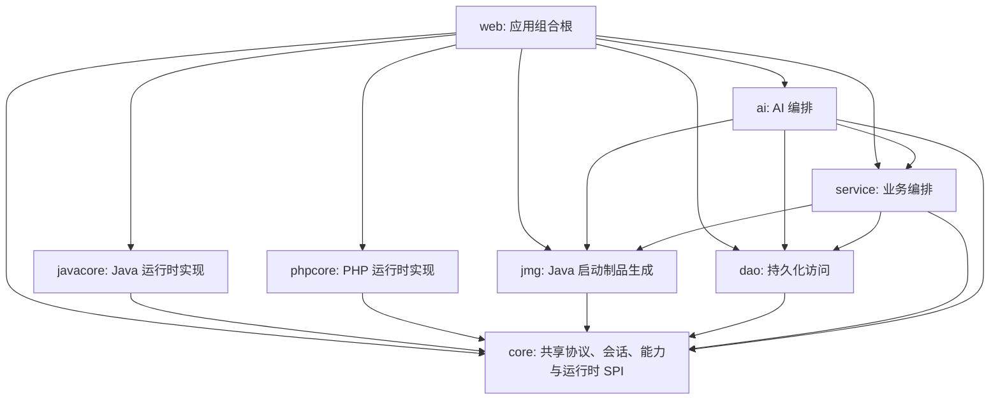

# Puppet 运行时模块架构

Java 和 PHP 是平等的 Puppet 运行时模块，不存在“Java core + PHP 适配器”的依赖关系。

箭头表示主源码的 Maven 编译依赖。`web` 是唯一组合根；运行时实现之间没有横向
编译依赖。测试作用域依赖不纳入这张图。

## 模块边界

- `core`：保留 `AbstractPuppetNode`、`PuppetRuntimeModule`、传输创建上下文、能力契约、RPC 契约、组件制品描述、通用会话状态，以及仅依赖 `ComponentInvokeCapable` 的共享代理/隧道引擎。禁止依赖 `javacore` 或 `phpcore`。
- `javacore`：拥有 `JavaPuppetNode`、Java component 源码与 payload、Java 组件调用服务和 component 字节码审计。
- `phpcore`：与 `javacore` 使用同一 SPI，提供 `PhpPuppetNode`、PHP RPC、按需 component、脚本生成器、插件执行与 PHP 伪装校验。
- `service`：依赖 `core`、`dao` 与制品生成模块 `jmg`，通过 `PuppetRuntimeModule` SPI 选择实现；主源码不依赖 Java/PHP 运行时实现。
- `ai`：负责模型、对话、工具和任务编排，依赖 `service`、`dao`、`jmg` 与 `core`，不直接绑定 Java/PHP 运行时实现。
- `web`：应用组合根，将 `service`、`ai`、`javacore`、`phpcore` 和 `jmg` 组装为单体应用。
- `web` 和 `ai`：只面向 `AbstractPuppetNode` 和 capability 接口编程，禁止强制转换为 `JavaPuppetNode` 或未来的 `PhpPuppetNode`。

## 维护与审计约定

1. 控制器只处理参数校验、协议转换和结果映射；业务流程放在对应 service 中。
2. 跨运行时能力先在 `core` 定义 capability 或 SPI，再分别由 `javacore`、`phpcore` 实现。
3. 一个状态只保留一个权威所有者；线程池、连接表和任务表必须由创建它们的 service 统一关闭。
4. 轮询、重试和资源清理拆成命名明确的小方法，主循环只保留流程顺序，避免多层嵌套。
5. 删除代码前同时检查直接调用、方法引用、Spring 注解、MyBatis 映射、反射字符串和制品生成扫描；仅删除确认没有入口的实现。
6. 新增抽象需要至少两个真实使用方；只有单一调用方时优先使用普通方法和直接数据结构。
7. 保留兼容性分支时在相邻注释说明运行环境或协议约束，避免后续审计把必要分支误判为冗余。
8. 架构文档只描述当前结构，变更过程由 Git 记录；源码注释不保留“原实现”“新版”“临时补丁”等过程叙述。
9. 数据结构补齐集中在 `DatabaseInitializer`，业务服务不保留永久的数据兼容旁路；测试直接使用当前公共 API。

## Web AI 执行边界

平台 AI 与 Puppet AI 共用 `AiSseExecutor` 和 `AiSseEventPump`。对话任务进入有界队列，事件下发采用独立的直接交付线程域，避免长连接占满对话执行线程；两类线程均为 daemon，并由 Spring 容器在退出阶段统一中断回收。事件泵集中维护 200ms 队列等待、5s 心跳、1s 停止等待和最终同步 flush。

模型能力探测与 Puppet 会话预热共用 `AiBackgroundExecutor` 的两个隔离执行域：预热使用 4 个工作线程和 128 项队列，探测使用 4 个工作线程和 32 项队列。队列饱和时预热会释放幂等标记，后续访问可重新触发；模型探测具有独立的超时与取消语义。执行器由 Spring 统一关闭。

内置 Skill 的唯一源码位于 `ai/src/main/resources/skills`。`SkillSeedInitializer` 在启动时
同步到 VFS 的 `skills/` 运行目录；运行副本由环境管理并在 Git 中忽略，避免同时维护两份内容。

## 后台传输与导出任务

`ServiceTaskExecutor` 为 SQL 导出、文件上传和文件下载提供三个隔离的有界执行域：SQL 导出为 4 线程与 32 项队列，上传为 4–8 线程与 64 项队列，下载为全局 32 个 worker 与 256 项队列。下载任务接受调用方指定的 1–16 并发度，worker 由全局执行域调度。批量提交下载 worker 时采用整组回滚，容量不足时取消本次已接收 worker 并将任务置为明确终态。

上传、下载和 SQL 导出的完成、失败、取消任务在内存中保留 30 分钟，由统一定时清理器每 10 分钟回收。容器退出阶段先取消活动任务并清理任务表，再由共享执行器中断剩余工作线程。

## 网络任务执行边界

反向隧道的本地拨号使用固定上限的有界执行域：每个 listener 最多使用 8 个 daemon 拨号线程，队列容量与 listener 的最大连接数一致，正在拨号和已建立的连接共同计入连接上限。拨号线程负责建立本地连接并启动双向中继；任一中继方向结束后通过同一个幂等清理路径注销统计、关闭两端连接并释放连接表项。停止 listener 时同时清空等待拨号集合、关闭本地 socket 并中断尚未执行的拨号任务。

HTTP Fuzzer 使用 `HttpSenderEngine` 级共享执行域，默认 50 个 daemon worker、256 项等待队列，并限制为 16 个活动任务。每个任务只提交用户指定数量的 runner，runner 通过原子游标按需领取最多 10000 个 payload 组合，避免把每个组合都包装为独立队列任务。批量提交中途遇到容量不足时会取消本次已接收的 worker、清理队列并删除未启动任务；停止任务和关闭引擎会取消已登记的 `Future` 并主动清理取消项。

## 平等性约束

1. 每个运行时只能注册一个 `PuppetRuntimeModule`，重复注册在启动阶段失败。
2. 新增上层功能必须先定义通用 capability，由运行时实现它；控制器只在协议入口处完成运行时分派。
3. 某运行时尚未实现的能力通过 `RuntimeProfile` / `CapabilityStatus` 声明为不可用，而不是假设 Java 能力必然存在。
4. component、plugin、脚本生成和伪装策略的实现归各自运行时模块；跨运行时的元数据契约归 `core`。

## PHP 运行时状态

`phpcore` 是可用运行时，`isReady()` 返回 `true`。交付范围：

- 通过通用 `PuppetNodeFactory` 创建 PHP 节点；测试连接只返回稳定 hostId 和缓存组件名，运行环境详情由 `BasicInfoComponent` 按需读取。
- 使用协议 v3 完成请求/响应伪装、HTTP RPC、URL/填充/Header Noise 策略及 hostId 传递。
- 提供基础信息、命令、文件、分块上传下载、压缩/解压、PHP 脚本、PDO 数据库、HTTP 发包、SOCKS5/HTTP 代理、本地转发、反向隧道、平台插件、进程管理、网络拓扑、实时网络连接、端口扫描/主机探活、服务管理、计划任务、注册表、事件日志、防火墙和用户账户 capability。
- 通过 `/platform/shell-generator/generate/runtime` 生成 PHP 5.6+ 单文件 HTTP 启动器；外层只负责伪装编解码，内层使用与 Java Core 对齐的运行时中立操作协议完成测试、转发、加载和调用。组件按 digest 懒加载到目标临时目录，业务和运行环境检测逻辑均由组件承载。
- 平台脚本生成器、伪装管理、插件管理/调用、节点信息页和 AI 插件工具均按 runtime 识别 PHP。

PHP endpoint 虽然采用请求式 HTTP 传输，但虚拟终端通过会话 ID 在目标临时目录维护进程与输出状态：Unix 优先使用 Python PTY，缺少 Python 时使用无额外依赖的命令后端；Windows 使用命令后端。只有真实 PTY 支持终端尺寸调整，命令后端仍保留工作目录、输入缓冲、清屏、中断和输出游标等稳定交互行为。网络代理组件同样使用目标临时目录中的队列和独立 PHP worker 保持跨请求 socket 状态，启动 worker 至少需要 `shell_exec`、`exec` 或 `popen` 之一。压缩/解压依赖目标环境的 `ZipArchive`。数据库管理层使用与运行时无关的连接描述，Java 适配器生成 JDBC 参数，PHP 适配器独立生成 PDO DSN；PHP 组件不解析或接收 JDBC URL。目标 PHP 需安装对应的 `pdo_mysql`、`pdo_pgsql`、`pdo_sqlsrv`/`pdo_dblib`、`pdo_oci` 或 `pdo_sqlite` driver。

PHP 启动器的组件缓存目录、文件名、扩展名和原子写入前缀均由生成 seed 派生；有状态 component 的状态目录与 worker token 则由部署路径派生。目标临时目录和后台进程参数不携带固定产品名，且同一 endpoint 内保持稳定，避免影响缓存命中与任务恢复。

目标完成首次握手并返回稳定 hostId 后，平台为每个 PHP component 派生 endpoint 专属组件别名和局部变量符号表，重新计算变体 digest 后再按需投递。目标缓存与 Ping 仅保存、返回不透明别名，`PhpPuppetNode` 在平台侧恢复为共享 capability ID；同一 endpoint 的变体保持稳定，不同 endpoint 的 component 源码和缓存 key 不同。

有状态 component 会把 config、status、queue、heartbeat 等逻辑文件角色映射为部署路径派生的不透明文件名。Scan 进度按开放端口、16 项批次或 250ms 时间窗落盘，Proxy worker 的状态写入限制为每 5 秒一次；Proxy 与 ReverseTunnel 会按运行状态和最后活动时间回收过期目录。

component 变体构建阶段会把 `msg` 与异常诊断文本拆分为 endpoint seed 派生的等价 PHP 表达式，目标返回语义保持不变，缓存源码中不连续保存完整诊断句。`HttpRequestComponent` 的默认 User-Agent、Accept 与 Accept-Language 按目标操作系统选择一致画像，并在同一部署路径下保持稳定；显式请求头始终优先。

Linux 下的 Process 列表、端口到 PID 的归属、NetworkConnection socket 表和 Disk 挂载信息优先直接读取 `/proc`，结合 `disk_total_space`、`disk_free_space` 与 `posix_getpwuid` 完成解析；Unix 进程信号优先调用 `posix_kill`。Windows、macOS 以及受限 proc 挂载继续使用各自命令后端。

PHP 平台侧 HTTP 客户端以 endpoint 地址和 hostId 派生会话级传输画像：User-Agent、Accept、语言、同源 Referer、可选 Header 集合及生成 URL 在会话内保持稳定，调用方显式配置继续拥有最高优先级。携带请求体的方法只使用文本/API 类型的动态扩展名；启用 Padding 后优先补齐至有界的 1/2/4/8 KiB 长度桶并使用请求 seed 派生字段名。多次请求沿用原 RPC requestId，失败重试采用有上限的指数退避和确定性抖动。多层寄生链路会把内层伪装默认 Header 与节点 Header 合并后交给 Relay，缺省补齐二进制 `Content-Type` 并固定 `Accept-Encoding: identity`，避免中转容器按表单消费请求体或返回平台无法识别的压缩内层响应。

PHP 运行时另外注册两个 protocol-v3 内置流量画像：`inner_PHP_JSON_API_1.0.0` 使用 JSON API envelope，将协议负载放入 Base64URL 编码的 `data` 字段，并附带状态、版本和时间字段；`inner_PHP_FORM_SYNC_1.0.0` 使用 `application/x-www-form-urlencoded` 的同步表单结构，提供 `action`、`v`、`ts` 和 `data` 字段。两种画像均复用 `PortableJsonCodec` 的二进制类型标记，支持平台 Java 编解码与 PHP 5.6+ 目标端互逆，无需 JSON 之外的额外扩展。JSON API 适合双向或响应层，Form Sync 更适合作为请求层，也可在需要时双向使用。解码器严格校验画像版本、动作字段、重复表单字段、Base64URL 长度和 16 MiB 原始消息边界；回归测试覆盖 Java 编码 → PHP 解码 → PHP 编码 → Java 解码的完整互操作链路。

PHP endpoint 的组件缓存按最近访问时间维护，最多保留 48 个制品，七天未访问的制品和五分钟未完成的原子写临时文件会被回收；平台侧 endpoint component 变体缓存采用 1024 项 LRU。终端状态通过临时文件加原子 rename 更新。Scan 最多保留 64 个任务，Proxy 最多保留 128 个连接目录，ReverseTunnel 最多保留 32 个 listener 和每 listener 256 个活动连接；代理和隧道队列单文件限制为 8 MiB。关闭的连接子树会按 TTL 回收，后台 worker 启动超时会写入停止标记。

Java `ComponentService` 同样以 endpoint 地址和 hostId 派生会话级传输画像，并复用稳定 URL、Header 集合、User-Agent、语言与同源 Referer。携带请求体的方法限制动态路径扩展名，显式 Header 继续优先。启用 Padding 后使用有界长度桶和请求派生字段名；重试沿用原 RPC requestId，并采用有上限的指数退避和确定性抖动。会话 HostId 列表刷新使用独立短连接执行多次 PING，以绕开负载均衡连接/Cookie 亲和并收集后端实例，同时保持当前 HostId 不变。

## Puppet 侧运行代码清单

需要在目标 Puppet 环境执行的代码按运行时分为三类：

| 类别 | 位置 | 当前规模 | 加载方式 |
| --- | --- | ---: | --- |
| Java component | `javacore/src/main/java/org/leo/core/component` | 28 个单类组件 | 编译为同名 `.payload`，由 Java Core 按需加载 |
| PHP component | `phpcore/src/main/resources/components` | 25 个独立 PHP 文件 | 按内容 digest 写入目标临时目录并按需加载 |
| 启动与协议模板 | `jmg` 的 `LeoCore`/shell 模板、`phpcore/src/main/resources/templates` | 按运行时生成 | 生成单文件入口，负责握手、转发、组件加载与调用 |

Java component 必须保持 Java 6 字节码兼容，并且每个 payload 可以独立加载，因此不会为了减少少量重复而引入跨 payload 的公共运行时依赖。Java Core 与 Component 的运行时类名按 hostId、endpoint 和 component 标识派生：同一节点使用一致的应用包族，重试及重启保持类名和成员变体稳定，并避开 JDK 保留命名空间与 lambda 后缀。转换过程保留 major version 50，并在移除调试元数据和注解后通过 ASM 重建常量池。PHP component 同样是独立制品；`$get` 等极小的局部读取函数保留在文件内，避免组件依赖启动器版本或预加载顺序。目标侧的超时、输出上限、临时文件清理和状态过期属于稳定性边界，不作为冗余降级删除。

Java 平台侧已加载 Component 状态采用 host LRU、单 host 数量上限和空闲 TTL，节点关闭时统一清理所有 service 缓存。需要工作池的单类 Component 直接实现 `ThreadFactory`，以运行时类名画像生成线程名，避免默认 `pool-N-thread-M` 以及固定功能名称；该方式不会产生额外内部类。请求失败在常规日志级别只记录操作、尝试次数、异常类型和摘要，堆栈保留在 debug 级别。Component 编译脚本逐源码、限堆编译，并在 Java 8 javac 不可用时使用 ECJ，最终仍执行 major version、单 class 和 Java 6 API 审计。

同一 `JavaPuppetNode` 创建的全部 `ComponentService` 共享节点级加载注册表。相同 host/component 的并发加载通过 single-flight 合并为一次 class 定义请求，随后各 service 直接复用共享状态，避免同名类在同一 ClassLoader 中重复定义。连续加载失败达到阈值后进入有界冷却期，降低重复传输大体积制品的固定节奏；关闭节点时递增注册表 generation，较早的在途加载结束后不会重新写回已清理缓存。

`JavaPuppetServiceRegistry` 统一维护 31 个 Java 平台服务实例的 hostId、请求/响应层、传输画像、最大请求次数和已加载组件状态广播，并集中执行关闭清理。最大请求数表示普通失败场景下一次操作允许发送的请求总数，包含首次请求；`1` 表示普通失败不重试，`3` 表示最多重试两次。HostId 亲和始终启用，不暴露人为开关；目标实例返回 `HOST_ID_MISMATCH` 时尚未执行组件操作，平台会清理学习 Cookie、逐次淘汰复用连接，并在至少八次的亲和窗口内继续携带原 HostId 抽取后端。亲和尝试耗尽时平台通过 PING 重新绑定实例并清理实例级缓存，但不会自动重放已经进入目标组件的业务操作。`JavaPuppetNode` 继续直接实现 capability 委托，服务字段和调用路径保持扁平，避免为每类 capability 引入额外聚合层。

## Web Runtime 版本策略

容器管理以 `WebRuntimeManageCapable` 为唯一上层能力入口。平台先根据基础信息解析
`runtime family + product version`，再由 `WebRuntimeProfileRegistry` 选择版本画像和目标侧
adapter；目标侧结构探测结果继续细分为 `strategyId`。HTTP 层只暴露
`/puppet-node/web-runtime/inspect` 和 `/puppet-node/web-runtime/components/remove`。

Tomcat 显式版本画像：

| 产品线 | Servlet API | 命名空间 | 管理策略 |
| --- | --- | --- | --- |
| Tomcat 6 | 2.5 | `javax.*` | Tomcat adapter，版本画像内结构探测 |
| Tomcat 7 | 3.0 | `javax.*` | Tomcat adapter，版本画像内结构探测 |
| Tomcat 8.0 / 8.5 | 3.1 | `javax.*` | 独立 profile，版本画像内结构探测 |
| Tomcat 9 | 4.0 | `javax.*` | Tomcat adapter，版本画像内结构探测 |
| Tomcat 10.0 | 5.0 | `jakarta.*` | 独立 profile，版本画像内结构探测 |
| Tomcat 10.1 | 6.0 | `jakarta.*` | 独立 profile，版本画像内结构探测 |
| Tomcat 11 | 6.1 | `jakarta.*` | Tomcat adapter，版本画像内结构探测 |
| 未识别或更新主版本 | 探测值 | 探测值 | 只读，等待回归矩阵确认后开放修改 |

Tomcat adapter 通过 feature probe 区分 listener 的 list-field、objects-field、
array-field 等存储结构，不用版本号直接猜测私有字段。修改操作每次重新扫描活动
Context，完成后再次读取注册表验证结果。

其他中间件：

| Runtime family | Adapter | 当前能力 |
| --- | --- | --- |
| WebLogic 10 / 12 / 14 | `WeblogicContainerManageComponent` | Servlet、Filter、Listener 检查与验证式移除 |
| Jetty、WildFly/JBoss、Undertow | `GenericServletContainerManageComponent` | 标准 Servlet Registration API 只读检查 |
| WebSphere Traditional / Liberty | `GenericServletContainerManageComponent` | 标准 Servlet Registration API 只读检查 |
| GlassFish/Payara、Resin | `GenericServletContainerManageComponent` | 标准 Servlet Registration API 只读检查 |
| Apusic、TongWeb、BES | `GenericServletContainerManageComponent` | 标准 Servlet Registration API 只读检查 |

框架 adapter 目前覆盖 Spring MVC / Spring Boot MVC、Spring WebFlux、Struts2、
JSF/Jakarta Faces、JAX-RS/Jersey/RESTEasy、Wicket、Play、Micronaut 和 Quarkus。
Spring MVC 与 Struts2 开放控制器/拦截器验证式移除，JSF/Faces 仅开放
PhaseListener 移除；WebFlux 与其余框架保留检测或只读运行时视图。

Web Runtime 返回稳定的 `runtimeId/contextId/componentId`，并把
`capabilities.detect/inspect/remove` 随 runtime 下发。前端只根据 capability 渲染
操作入口，并且仅把 `status=CHANGED && verified=true` 视为修改成功。未知版本默认
停留在只读画像，避免把相邻大版本的私有结构当作兼容合同。

完整制品分组如下：

- Java/PHP 共有的基础能力：`BasicInfo`、`Compress`、`Database`、`Decompress`、`ExecCommand`、`ExecCommandSimple`、`ExecScript`、`File`、`FileDownload`、`FileUpload`、`HttpRequest`、`Plugin`、`ProxyForward`、`ReverseTunnel`；PHP 另外以独立 component 交付 `Process`、`NetworkInfo`、`NetworkConnection`、`Scan`、`Service`、`ScheduledTask`、`Registry`、`EventLog`、`Firewall`、`UserAccount`，Java 则通过运行时服务或专用 payload 实现同名 capability。
- Java 专有的容器与系统能力：`CredentialHarvest`、`FileEnhance`、`Fingerprint`、`HostIsReachable`、`PortScan`、`ReconScan`、`Resource`、`Screen`、`SpringFrameworkManage`、`JavaWebFrameworkManage`、`GenericServletContainerManage`、`TomcatContainerManage`、`WeblogicContainerManage`。
- Java 启动制品：`LeoCore` 动态生成 Core 字节码，配合 7 个 HTTP shell 模板和 9 个格式化/加载模板。各模板按目标容器、入口格式和 JDK 边界分别生成。
- PHP 启动制品：`php-core.php.txt` 与 `php-puppet.php.txt`，分别承载 RPC 内核和单文件 HTTP 入口。

## 兼容性与降级策略

目标侧实现统一遵循以下约束：

1. 同一操作系统上的一项能力只保留一个主实现和至多一个功能性降级实现。
2. Linux、macOS、Windows 的系统接口差异属于平台实现，不叠加为同平台的多层候选链。
3. 不依次探测多个可选外部程序；主实现不可用时直接进入无额外依赖的基础实现。
4. 降级实现不伪装完整能力，通过 `pty`、`resizable`、`backend` 等元数据明确能力边界。
5. 为兼容旧运行环境保留必要的语法、反射和系统分支，但删除不可达分支、未使用变量及只增加路径数量而不改善契约的候选实现。

当前关键能力矩阵：

| 能力 | Java | PHP |
| --- | --- | --- |
| Unix 虚拟终端 | Python PTY；直接 shell pipe 降级 | Python PTY；命令后端降级 |
| Windows 虚拟终端 | `cmd.exe` pipe | 命令后端 |
| 终端 resize | 仅 Python PTY | 仅 Python PTY |
| 一次性命令 | `ProcessBuilder` | `proc_open`；`exec` 降级 |
| HTTP 发包 | `HttpURLConnection` | cURL；PHP stream 降级 |
| 数据库管理 | 统一连接描述 → Java 适配器 → JDBC | 统一连接描述 → PHP 适配器 → PDO |
| SOCKS5 / HTTP / 本地转发 | 共享平台代理引擎 + Java socket component | 共享平台代理引擎 + PHP 后台 worker component |
| 反向隧道 | 共享平台隧道引擎 + Java listener component | 共享平台隧道引擎 + PHP 后台 listener worker |
| 基础信息 | JVM/系统接口与必要的 OS 分支 | `/proc`、`sysctl`、Windows 系统命令与 PHP 原生接口 |

虚拟终端只保留一个完整 PTY 路径和一个可预测的基础路径，不探测 `socat` 或多种 `script` 方言，避免目标环境因外部程序版本差异进入难以验证的分支。
