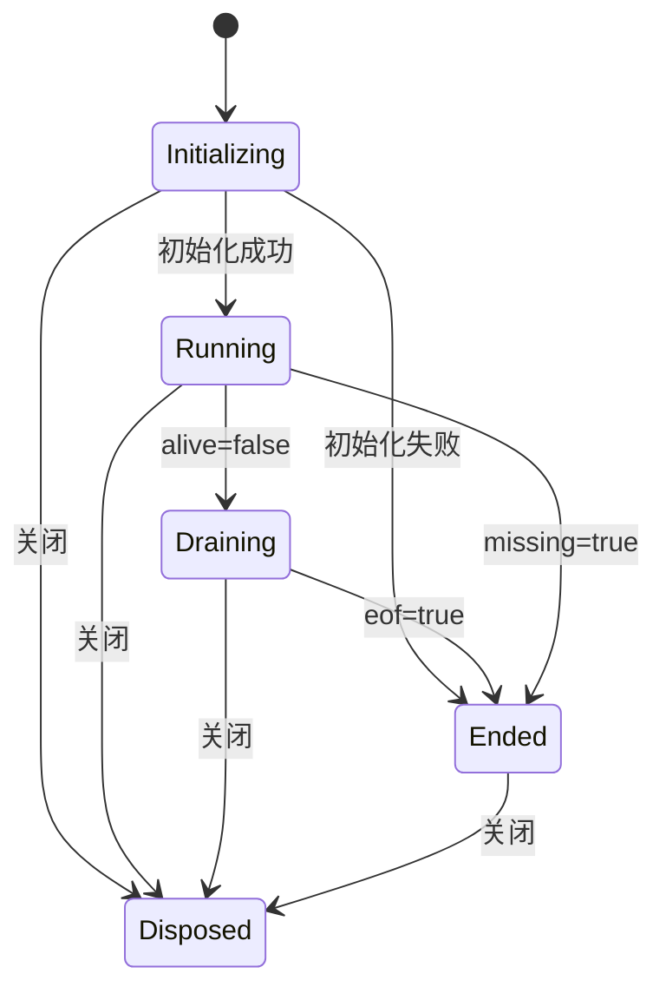

# 虚拟终端架构与维护

虚拟终端以 `hostSessionId + processId` 标识进程。前端使用 HTTP 请求传递输入、读取输出、调整尺寸和停止进程。Java/PHP 适配器沿用相同操作协议，目标端报告实际能力，界面据此区分 PTY、管道和逐条命令模式。

Java 默认使用原生管道，不探测 Python、不创建终端辅助文件。“＋ 新建”菜单统一选择 Java 原生管道或 Python PTY；每种模式拥有独立进程和 shell 状态，已有会话不能原地切换。Java Python PTY 仅适用于 Unix，依赖 Python 标准库的 `pty` 模块；缺少 Python 或启动失败时明确报错。PHP 保留现有初始化语义，点击“＋ 新建”直接创建会话，不展示 Java 模式选择。

## 职责边界

前端仓库为相邻的 `LeoVueAi`，以下路径均相对各自仓库根目录。

| 层 | 代码 | 职责 |
|---|---|---|
| 工作台视图 | `src/components/PuppetConsole/terminal/TerminalConsole.vue`、`TerminalSessionRail.vue` | 布局、会话列表和用户操作 |
| 终端渲染 | `terminal/TerminalViewport.vue` | xterm 生命周期、搜索、尺寸适配；通过事件传递输入 |
| 工作台编排 | `terminal/useTerminalWorkspace.js` | 标签增删切换、搜索、未读标记和视图协调 |
| 轮询调度 | `terminal/useTerminalPolling.js` | 工作台和 Docker 复用的定时器、页面可见性监听及作用域清理 |
| 单会话控制 | `terminal/createTerminalSessionController.js` | 初始化、顺序写入、读取去重与退避、resize 防抖、关闭补偿及重试；不依赖 Vue 或 xterm |
| 输出排序 | `terminal/createTerminalOutputStream.js` | 写响应、单次与批量读响应按同一序号消费；乱序缓存、缺口提示和 EOF 顺序 |
| 输入队列与编辑 | `terminal/createTerminalInputQueue.js`、`createTerminalLineEditor.js` | 队列按操作类型合并连续输入；编辑器返回发送内容、回显内容和错误，由控制器统一处理 |
| 会话模型 | `terminal/terminalWorkspaceModel.js` | 可展示的会话状态、能力说明、单向生命周期更新 |
| 终端协议与配置 | `terminal/terminalProtocol.js` | 输入与轮询常量、尺寸约束、UTF-8 流式解码 |
| 响应校验 | `src/services/terminalResponse.js` | 单次请求、批量读取及写入附带输出共用组件响应校验；不做宽松类型转换 |
| 读取合并 | `src/services/terminalReadBatcher.js`、`src/services/api/puppet-node.js` | 合并同一调度轮次、同一节点的普通读取；按进程分发结果，限制批量大小 |
| 容器接入 | `src/components/PuppetConsole/Docker/useDockerTerminal.js` | 容器选择和 attach 命令；复用单会话控制器 |
| HTTP 边界 | `web/.../command/CommandController.java`、`CommandExecRequest.java`、`TerminalBatchReadRequest.java` | 单次与批量请求校验、能力与权限检查、失败响应和审计 |
| 终端能力 | `core/.../capability/TerminalCapable.java` | `execTerminal` 统一接收操作、初始化模式和附带输出选项；`readTerminals` 批量读取 |
| Java 适配器 | `javacore/.../puppet/service/CommandService.java` | 向节点提交单次或批量终端请求 |
| Java 请求编码 | `javacore/.../puppet/service/TerminalRequests.java` | 集中维护操作码、参数编码和 PTY 源码装载；终端适配器与内部命令执行器共用 |
| Java 目标组件 | `javacore/.../component/ExecCommandComponent.java` | 进程注册、输入输出、PTY/管道后端、进程树与空闲清理 |
| Java PTY 桥接源码 | `javacore/src/main/resources/terminal/pty_bridge.py` | 用标准库 `pty.spawn` 启动 Unix PTY 并转发原始字节；由平台在 PTY 初始化时传入 |
| PHP 目标组件 | `phpcore/src/main/resources/components/ExecCommandComponent.php` | 状态文件、PTY 桥接、命令模式；入口持有会话锁，各操作由局部闭包处理 |

普通写入、指定模式初始化及附带输出共用 `execTerminal` 调用链，不再分别增加适配器入口。内部命令工具仍通过 `CommandCapable.execCommand` 调用，其默认实现转发到 `execTerminal` 并关闭附带输出，由调用者决定读取时机。

## 生命周期与并发约束

- `processExited` 表示不再接受输入，`ended` 表示输出已读完或初始化失败。迟到的 `alive:true` 不会将已结束的会话重新激活。
- Promise、计时器、写队列、解码器和重试计数属于控制器私有资源，不放进 Vue 响应式状态。状态对象只保存视图和能力信息。
- 输入队列以批次保存内容、UTF-8 字节数和调用者等待结果，无需发送前遍历每个按键重新拼接。PIPE 行编辑器只维护编辑状态并返回结果，控制器负责回显、报错和取消队列；粘贴超限时取消尚未发送的命令。
- 同一会话最多一个读取请求。输入按序写入，不等待读取完成；PHP 命令模式的独立 Ctrl+C 请求可越过写队列，并作废排队的旧输入。
- 初始化及后续写入发送 `includeOutput=true`，节点在同一次调用中附带当前可读的最多 64 KiB 输出，不额外等待。写响应保留 `written/initialized` 等确认字段，嵌套 `output` 使用读取响应结构；附带输出读取失败只设置 `output.code=500`，不覆盖成功的写入确认。前端单独显示输出错误，不重发输入。
- 写响应、单次读取和批量读取共用每个进程从 1 开始递增的 `outputSequence`，包括空读。Java 在进程状态锁内分配序号、消费缓冲并形成输出状态；PHP 在会话锁内读取并保存序号，长命令重新取得锁后加载最新状态。输出按序进入 UTF-8 解码器，EOF 也按序处理，重复序号不重复显示。
- 收到乱序输出后，前端等待在途请求补齐缺口，暂停新增读取，后续仍可发送的输入暂不要求附带输出，从而限制缓存增长。会话缺失响应等待在途输出处理完再结束。所有相关请求结束后仍有缺口时显示输出丢失提示，重置解码器并继续显示后续字节，不重放命令或已消费的读取。
- 写入成功后不再立即补发一次读取，轮询时钟负责续读。PHP 命令响应已附带完整输出与提示符（`busy=false, hasMore=false`）时，从 3 秒空闲间隔恢复；PTY/Java 延续原调度，剩余输出和退出后的排空跳过空闲等待。PHP 长命令运行期间仍允许单独读取和中断。
- PTY 和 PHP 命令终端的流式输入使用 100ms 合并窗口，连续输入不会推迟窗口截止时间；回车、Tab、Ctrl+C 等控制字符立即触发发送。已有写请求在途时继续积累，响应后合并发送。同一批待发送数据不超过 1 MiB，超限取消尚未发送的输入；失败写入不自动重试，并丢弃后续排队输入，避免重复执行或误执行。
- 只有节点明确报告 `lineInput=true` 且 `pty=false` 时才启用 PIPE 本地编辑：输入、Unicode 退格、Ctrl+U 和 Ctrl+C 清空在本地完成，回车后通过 `write-line` 提交完整行；多行粘贴可一次发送，未完成的最后一行继续留在本地。节点直接写入 shell，不再回显这批输入。PHP 命令终端使用 `write` 和远端回显。
- 控制器通过 `isCurrent` 隔离主机切换后的旧响应，通过 `instanceId` 拒绝其他目标实例的响应。多个终端各自拥有解码器。
- 主机控制台切换会话时先卸载模块，取得新主机运行时信息后再挂载。初始化结果按请求版本隔离，旧请求不能覆盖新主机的能力、链路或就绪状态。
- 初始化使用独立 HTTP `type=init`（Java `op=6`、PHP action `init`），不携带命令。`write` 中的 `init` 原样输入，无需拆帧；只有初始化能创建进程，失效会话的写入明确失败。重复初始化运行中的会话保留进程、输入缓冲和输出序号。初始化失败后立即尝试停止远端进程。
- `dispose()` 可重复调用且返回同一个清理 Promise：立即停止进程；仅在初始化仍在途时等待它结束并补做停止。普通写入不会创建进程，关闭不再等待写响应或为其额外发送停止请求。每次停止最多尝试三次，失败交给调用者的 `onError`。
- 工作台和 Docker 各自拥有 250ms 轮询时钟，控制器决定某个会话是否需要读取。前台 Java 长轮询最多等待 10 秒，有输出立即返回；空读后在下一个调度周期续接，不额外叠加空闲等待。浏览器长轮询请求超时为 30 秒，平台到节点的默认读取超时同为 30 秒。每次最多一个读取请求，持续至 EOF 或关闭。
- 不支持长轮询的前台终端（如 PHP）连续空读后，间隔依次为 3、5、10、20 秒，封顶 20 秒。后台终端、隐藏模块和隐藏浏览器页面使用非阻塞读取，间隔至少 5 秒，连续空读后为 5、5、10、20 秒。间隔从响应完成时计算；输入、重新激活和实际输出重置空闲计数，迟到的空响应不覆盖期间发生的活动。
- 切回终端或显示页面立即请求读取，已有读取在途时复用该请求；隐藏模块重新显示在下一个调度周期恢复。已知剩余输出（`hasMore`）和进程退出后的排空不等待空闲间隔，分段 UTF-8 字节也视为输出。后台空闲时的新输出最多延后约 20 秒被发现，不支持长轮询的前台终端同样存在该延迟。
- 当前前端要求独立初始化和带输出序号的新协议，不为旧节点增加降级分支。更新前端、服务器及节点组件缓存后重新创建终端；Java 新组件使用完整的 10 秒等待，PHP 组件版本为 3.0.0。
- Java 与 PHP 组件报告 `batchRead=true` 后，同一调度轮次、同一 `hostSessionId` 的非长轮询读取可合并。前端在微任务中收集请求，不新增等待窗口；每批最多 16 个不同进程，单个请求仍走原读取接口。前台长轮询和写入立即发送。工作台和 Docker 共用 API 层的合并入口。
- 批量读取通过一次浏览器 HTTP 请求和一次节点调用完成，按 `processId` 返回各自的 `instanceId`、输出、存活与 EOF 状态；缺失或失败只影响对应终端。整批先校验再消费输出，每个终端最多读取 64 KiB，整批原始输出最多 1 MiB，余下输出通过 `hasMore` 继续排空。PHP 批量读取使用非阻塞的状态锁和输出锁，被占用的终端单独报错并按原读取失败策略退避。
- 批量传输失败或缺少某个终端的结果时，前端报告读取错误，不立即改走单次读取重放该批请求。输出读取会消费缓冲区，当前协议不能在网络响应丢失后重放已消费的字节；后续调度读取剩余输出，与原单次读取限制一致。

## 参数边界

HTTP 读取仍以 `cmd` 表示等待毫秒数，空值为非阻塞；非空值必须是 32 位非负十进制整数，超过 10000ms 时限制到 10000ms，非法值在访问节点前返回 400。Java 适配器对内部调用执行相同校验。PHP 不支持长轮询，读取的 `cmd` 必须为空。`init/stop` 的命令必须为空，`terminalMode` 仅能用于 Java 初始化，`includeOutput` 仅用于初始化与输入。

Java 线协议按字段固定类型：`op/waitMs` 为整数、`includeOutput` 为布尔值、`terminalMode` 为字符串，`cmd/processId/processIds/ptyBridge` 为 UTF-8 字节数组。节点入口先校验请求，再分发操作，不接受字符串数字和任意对象转字节；校验在创建进程或消费输出之前执行。PHP 命令为字符串、附带输出标志为布尔值，不接受 Java 模式与等待字段。

## 目标组件约束

Java 组件必须编译为 Java 6 单 class payload；PHP 组件必须作为独立 PHP 5.6+ 文件加载。因此目标组件内部按职责划分方法或闭包，不依赖其他组件文件。PHP 的 `$terminalResponse` 统一能力字段，`$readSession/$writeSession/$resizeSession/$stopSession` 各自处理一种操作，入口只负责参数检查、文件锁与分发。

Java 输出线程直接持有对应进程状态，不通过额外的全局线程参数表查找会话；输出线程和空闲清理线程复用创建入口，后台线程不继承请求的上下文类加载器。PIPE 回显与进程输出共用有界缓冲入口，截断标记与输出在同一个锁内读取。组件实例使用 UUID 标识，请求入口统一写入响应状态码和实例标识。

Java 写入入口只负责按输入方式分发：PTY 原始字节、前端编辑后的完整行、`write` 流式输入。两种管道输入共用字符集转换和换行写入方法，避免 Windows 编码及 CRLF 处理分散维护。批量读取和写响应的附带输出共用 `readOutputResponse`，统一输出上限、缺失进程响应与独立错误边界。

Java 关闭先终止进程，再关闭标准输入，避免被正在阻塞的写入占住流锁。Windows 管道提交时将 UTF-8 输入转成与输出读取一致的节点字符集，前端回显仍使用 UTF-8；实际 `cmd` 代码页须在 Windows 环境验证。

Java 初始化请求可指定 `terminalMode=pipe|python-pty`，未指定时为 `pipe`。响应返回实际 `terminalMode` 和 `terminalModes`（Unix 两种、Windows 仅管道）。`TerminalRequests` 仅在 PTY 初始化时装载应用资源中的 Python 源码并发送 `ptyBridge`，节点通过参数启动 Python，无需生成脚本或尺寸文件。

Python 桥接仅三行：导入、EOF 读取回调、`pty.spawn` 调用。任一流读到 EOF 时回调退出桥接进程，系统随进程退出关闭 PTY，避免默认实现持续等待；节点停止和空闲回收仍由 Java 进程管理负责。不再发送启动握手或转换 shell 退出码；Java 使用统一的进程启动探测，`exitCode` 表示桥接进程退出码，正常结束通常为 0，即使 shell 执行了 `exit 7`。

Java 直接向 Python 标准输入写入终端字节，标准输出全部为原始终端字节，JVM 负责有界缓冲和轮询读取。Java 启动 PTY 时设置 `TERM=xterm-256color`。Java 的 PIPE 和 PTY 均返回 `resizable=false`；PTY 使用 shell 默认尺寸，不随浏览器窗口变化，也不保证固定为 80×24。前端据此显示固定尺寸并跳过 resize 请求，直接发送 resize 时返回 `resized=false`。管道默认使用本地行编辑；`write` 流式接口提供节点逐行缓冲、回显、UTF-8 退格和 CR/LF 归一化。管道不支持方向键历史、完整作业控制和终端信号语义。管道 Ctrl+C 清空当前输入并提示信号限制，关闭会话仍会终止进程。

HTTP `type=write-line` 在 Java 适配器转换为 `op=4`。输入必须以 LF 结束且整个请求不超过 1 MiB，组件拒绝 PTY 上的整行写入；目标会话不存在时写入明确报错，不会自动新建进程，读取仍返回 `missing=true, eof=true`。Windows 按节点字符集和 CRLF 写入。该操作与 `write` 的节点行缓冲独立，客户端应按协商能力固定使用一种输入方式。AI 交互工具继续使用 `write` 流式接口；`ComponentService.execWithTimeout` 显式初始化后通过 `write-line` 提交完整命令和结束标记，避免输入回显导致提前结束读取，并在 `finally` 中关闭会话。

PHP 命令执行期间释放会话锁，输出文件有独立锁；其他请求可读取输出或写入控制信号。执行请求重新取得会话锁后合并最新状态。清理程序必须跳过 `running` 的命令状态，避免删除执行请求仍在使用的文件。读取在确认生产进程是否存活后再消费输出，最后判断 EOF。

PHP PTY 的 FIFO 写入为非阻塞操作，单次写入最多等待 1 秒；超时返回已写入字节数的错误提示并释放会话锁，允许后续关闭。桥接以 `select` 同时处理输入和输出，最多暂存 64 KiB 输入。PTY 和命令模式共用加锁的输出消费逻辑；Python 写入及轮转也持有同一文件锁，不再维护容易受轮转影响的独立读取游标。

PHP 命令模式保留目录和输入缓冲，不保留跨命令环境变量，不支持交互式标准输入。单次提交最多执行 20 秒，前端 write 超时为 45 秒。Docker 交互终端需要持续 shell，命令模式不启动 attach；PTY 使用 `docker exec -it`，管道模式使用 `docker exec -i`，避免无 TTY 时被 Docker 拒绝。详细线协议见 [puppet-response-protocol.md](puppet-response-protocol.md)。

## 验证入口

- 终端测试辅助传输位于前端 `terminal/test-support/terminalTransport.js`，仅供生命周期测试构造协议响应；输出排序测试直接提供实际序号，避免辅助逻辑掩盖乱序问题。生产代码要求对象响应及数字状态码，不接受旧的字符串响应或缺少状态码的响应。
- 前端：`npm test -- src/components/PuppetConsole/terminal src/components/PuppetConsole/Docker/useDockerTerminal.test.js src/services/terminalReadBatcher.test.js src/services/api/puppet-node.test.js`；修改视图或导入关系后运行 `npm run build` 和相关文件的 ESLint。
- 后端（JDK 17）：`./mvnw -pl web -am -Dtest=ExecCommandComponentTest,ComponentBytecodeProfileTest,CommandServiceTest,PhpExecCommandComponentTest,PhpComponentArtifactRegistryTest,PhpPuppetNodeTest,CommandControllerTest,CommandToolsInteractiveTerminalTest -Dsurefire.failIfNoSpecifiedTests=false test`。
- 修改 Java 目标组件后必须同步同名 `.payload`，并验证 major version 50、独立 class 和 Java 6 API。完整生成/审计入口是 `javacore/compile-components.sh`。
- PHP 回归测试使用本地 CLI 启动实际进程，覆盖并发读取、中断、关闭、EOF、大输出、输入编辑、执行上限及空闲回收；无 PHP 或无原生 PTY 时对应测试会明确跳过。
